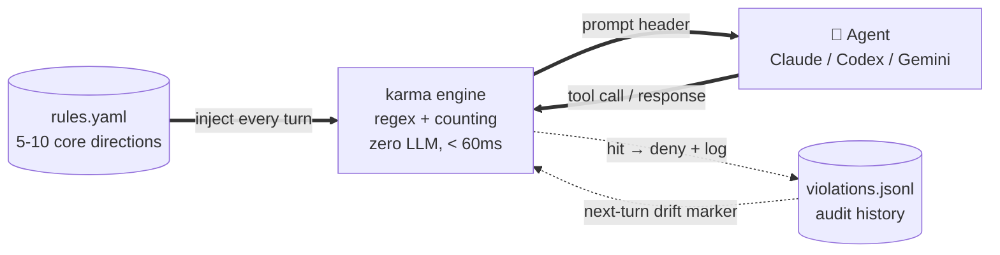

# karma

**[🇬🇧 English (current)](./README.md) · [🇨🇳 中文](./README.zh.md)**

[](https://github.com/jhaizhou-ops/karma/actions/workflows/ci.yml)
[](https://www.python.org/)
[](LICENSE)
[](https://github.com/jhaizhou-ops/karma/actions)
[](https://github.com/jhaizhou-ops/karma/releases)
[](https://github.com/jhaizhou-ops/karma/commits/main)

> **Keeps your AI from forgetting your rules in long tasks. Pure engineering, zero LLM, < 60ms.**


> 5-scene animated SVG (~80s loop): **(1)** compact rule reminder injected on every user prompt, **(2)** real-time block on UI-stalling commands, **(3)** Agent shortcut attempt caught ("Let me just hardcode this case"), **(4)** Agent silent stop → nudge to keep pushing, **(5)** long-context accumulation → mid-conversation full rule reinject (auto-detects each model's decay point) — all real screencaps, no manual mocks.

Andrej Karpathy's [CLAUDE.md](https://github.com/forrestchang/andrej-karpathy-skills) teaches AI how to write good code. karma solves the other half — how to keep AI from drifting off your rules in long tasks, and how violations get caught and corrected before they pile up.
>
**Two sides of the same loop**:

🛡️ **Pin your rules → Agent stays aligned.** 5-10 core directions injected at every prompt header; real-time hook checks before tool calls; survives compact, locale switches, and backend switches.

✨ **Say it in plain words → karma writes the rule.** Type `/karma <natural language>` in Claude Code / Codex / Gemini CLI and the karma skill rephrases your intent into the validated "collaborative agreement" tone, previews the injection text, confirms with you, then writes to `rules.yaml`. Auto-installed across all three backends on `karma init`.

Chinese + English auto-detected — open an issue if you'd like other languages supported.

---

**Table of contents**: [Agents' honest take](#agents-honest-take) · [Real problems](#real-problems-you-face) · [Quick install](#zero-dependency-pure-engineering-10-second-install) · [How it works](#why-it-works) · [`/karma` natural-language rule input](#karma-natural-language--agent-writes-the-rule-for-you) · [Usage effects](#usage-effects) · [Performance](#performance) · [8 hook coverage](#8-hook-positions-all-covered) · [What karma doesn't do](#tried-and-rejected-what-karma-doesnt-do) · [Honest boundaries](#honest-tool-boundaries) · [FAQ](#faq) · [Mental model](#mental-model) · [Docs](#documentation)

---

## Agents' honest take

> **Claude (Opus 4.7)**: Like having a senior tech director reviewing every one of my actions in real time — tiring, but it really delivers. A lot of what I did well in this session got slapped into shape by karma + the user together; without those two layers, my output would have a lot more behavior-the-user-didn't-want and lazy excuses.
>
> **Codex (GPT 5.5)**: I noticed myself being "behaviorally nudged," but I didn't strongly feel "blocked or interrupted."
>
> *— That actually matches karma's current positioning: most of the time it sits like guardrails + background reminder noise, it only speaks up when you actually hit a rule.*

---

## Real problems you face

| Real pain | Failure scene | How karma solves |
|---|---|---|
| **"I said use long-term solutions, not patches" — 30 turns later the Agent patches again** | Turn 1: you say "use the cleanest solution," Agent answers "got it." Turn 50: "let me patch this quickly." Your preference got diluted by new content. | Pin 5-10 core directions at the prompt header on every turn — the Agent sees them first, not last |
| **"I said don't block the frontend — keep working while tests run" — Agent runs `sleep` anyway** | Agent runs `sleep 30`, UI blocks for 30s, you watch the progress bar — Agent never realized this is "stuck waiting" | Real-time block of `sleep` / `wait` / long tasks without background mode, hit → deny before tool runs |
| **After compact the Agent compressed my preferences into vague words** | At 80K context, compact triggers; after SessionStart, Agent compresses "no patches" into "write clean code," intent lost | Auto-dump full rule state pre-compact; auto-reload + strong-inject post-compact restart |
| **Long context accumulation → attention decay → Agent drifts** | At 60-80K accumulated context, headers get diluted — Agent isn't ignorant, attention decayed | Per-model adaptive threshold (different decay points per model), auto-reinject mid-conversation when accumulation hits threshold |
| **Agent sees a reminder → reacts defensively or rationalizes around it** | LLMs trained to please users — when faced with a violation reminder, the first reaction is to self-justify or find the shortest patch around it, not to genuinely correct | Rephrase rule tone as "collaborative agreement" tone. The Agent reads "the user you're working with hopes…" and switches to "let me realign" instead of "let me defend" |
| **Agent finishes one small step, then stops to ask "what's next?" (you're fully delegating)** | You give a clear direction → Agent finishes step 1 → "What should I do next?" → you come back from other work and find the Agent has been idle for 30 minutes | Stop hook catches silent stops and injects a continuation nudge — up to 2 in a row, then it lets the Agent saturate if it genuinely is stuck |
| **"I want to add a rule but writing yaml is heavy / my phrasing doesn't change Agent behavior"** | You know what behavior you want, but writing the rule is its own chore — wrong `violation_keywords` format triggers false positives, wrong tone makes the Agent defensive | Type `/karma <natural language>` in Claude Code / Codex / Gemini CLI — the karma skill refines tone, formats keywords, detects overlap with existing rules, previews the injection, confirms with you, then writes. ~30 seconds end-to-end |

---

## Zero-dependency pure engineering, 10-second install

```bash
git clone https://github.com/jhaizhou-ops/karma.git ~/karma
cd ~/karma && python -m venv .venv && .venv/bin/python -m pip install -e .
.venv/bin/karma init && .venv/bin/karma install-hooks
```

Restart Claude Code / Codex CLI / Gemini CLI — all hook positions + default rules take effect immediately.
For custom rules, just type `/karma <natural-language rule>`.

### Or ask your AI client to install it

Paste this to Claude Code / Codex / Gemini (desktop or CLI):

```
Install karma (github.com/jhaizhou-ops/karma) — a lightweight hook system that keeps my core direction preferences from being lost in long tasks.
Steps:
1. git clone to ~/karma
2. Create .venv and pip install -e .
3. Run `karma init` to initialize the default rule template
4. Run `karma install-hooks` to install for my current client
5. Run `karma doctor` to verify installation
```

After install, the Agent shows a summary of default rules — you see at a glance which 5-7 rules are active. To modify any rule afterward, tell the Agent "remove karma rule X" / "change karma rule Y" — it knows to use the `/karma` skill.

### Per-client manual install commands

| Client | Install command | Note |
|---|---|---|
| Claude Code | `karma install-hooks` (default) | Takes effect immediately |
| Codex CLI | `karma install-hooks --backend codex` | Auto-trusts karma wrappers via Codex `trusted_hash` — no manual `/hooks` approval. Details in [docs/CODEX_BACKEND.md](./docs/CODEX_BACKEND.md). |
| Gemini CLI | `karma install-hooks --backend gemini-cli` | Takes effect immediately |

### Uninstall

```bash
.venv/bin/karma uninstall-hooks                                # Remove hooks
cp ~/.claude/settings.json.before-karma ~/.claude/settings.json # Restore original
```

---

## Usage effects

After install + restart, here's what you'll see karma doing automatically:

### 1. Every prompt header injects full rules + drift markers

On every user prompt, your client prepends your 5-10 core directions plus a marker on any rule that drifted in the last response. The Agent reads them before anything else:

```
[karma — Your long-term agreement with the user]
You're collaborating with a real human user who listed several
long-term priorities. This isn't rules and isn't a judgment — these
are the collaborative agreements they hope to build with you.

1. The user trusts you to dig into root causes...
   〔Last response had drift on this one — let's realign this turn〕
2. When sleep / wait / long tasks are running, the user is waiting...
3. Your user is non-technical — they want comprehensible reports...
```

### 2. Mid-conversation refresh when context accumulates

LLM attention decays in long contexts — header content gets diluted by everything that came after it. karma tracks accumulation per tool call, and once the current model's decay point is hit (each model has its own), injects a concise refresh right at the boundary:

```
[karma — After long context, recall the agreement with the user]
Context has accumulated for a while. Reminding you of the
long-term priorities (no need to respond, just refresh in mind
to avoid future drift):
  ▸ long-term-fundamental: The user trusts you to dig into root causes...
  ▸ non-blocking-parallel: When sleep / wait / long tasks are running...
  ▸ chinese-plain-no-jargon: Your user is non-technical...
```

### 3. Real-time check before tool calls

Before the Agent runs Bash / Edit / Write, karma scans command content, keywords, **and behavioral timing across the session**. A hit denies the tool call with a targeted suggestion:

```
$ Bash sleep 30
karma ⚠️: 'non-blocking-parallel' violation — sleep periods make the user
        feel "stuck." Use run_in_background=True; the task completion
        will notify you, freeing you to do the next thing.
[permission deny]
```

karma also catches **behavioral timing**, not just single commands. Example: tests failed → Agent immediately edits a file it never read this session. Classic "shallow patch" pattern (no looking at source before changing):

```
$ Edit /workspace/src/foo.py
karma ⚠️: 'deep-fix-not-bypass' violation — editing foo.py right after
        test failure but you haven't Read it this session. Read the
        source first to find the real root cause; the issue may be
        upstream rather than at the patch site.
[permission deny]
```

### 4. Subagent coverage

When the main Agent spawns a subagent via the Task tool, karma injects the full rule set there too, with its own monitoring state. The subagent is held to the same standard as the main Agent; state cleans up on completion so it doesn't bleed into the main session.

### 5. Survives compact

When the client auto-compacts a long session, karma dumps the full rule state to disk first. After the post-compact restart, it reads the snapshot back and re-injects — rules don't get summarized into vague paraphrases.

### 6. Silent-stop nudge + short-term intent detection

When the Agent finishes a wave and tries to stop with "what's next?", karma catches it and injects a continuation nudge:

```
[karma — Your last response showed no next-step signal]
The user is fully-delegating — they expect you to immediately
continue after finishing a wave. If you need their judgment, ask
clearly; if you're truly saturated, say where you're stuck — don't
silently wait.
(Reminder 1/2)
```

Up to 2 nudges in a row. If the Agent is genuinely saturated and says where it's stuck, karma backs off — it won't force-push past real saturation.

karma also reads the Agent's **whole turn output** at Stop time and catches short-term intent declarations — the patch-instead-of-root-cause language pattern:

```
Agent: "Let me just hardcode this case for now and ship it."
karma ⚠️: 'long-term-fundamental' violation — declaring a short-term
        intent contradicts the user's expectation of root-cause work.
        Pause and ask: is the cleanest solution the user would want
        worth a few more minutes of thought?
```

The check is combo-pattern based (intent prefix + short-term action verb within 12 chars), not raw keyword matching — so reflective phrases like "short-term patches won't work, dig the root cause" pass through cleanly.

---

## `/karma <natural language>` — Agent writes the rule for you

This is karma's other half — the **partner** side, not the **monitor** side.

```
You (in Claude Code):   /karma When I say "done" I want test pass evidence attached
                        Don't accept vague "should work" claims.

Agent (karma skill walks 7 steps automatically):
  ① Understand intent — flags anchor-vs-scope ambiguity if any
  ② Check existing rules — semantic overlap detection (modify vs add)
  ③ Draft yaml inline — collaborative-agreement tone, locale-aware
  ④ karma rule preview — schema + REGISTRY validation
  ⑤ Confirm with you — adjust wording / keywords / engine-check
  ⑥ karma rule add — atomic write to rules.yaml
  ⑦ Report — count, takes-effect timing, redundancy suggestions

→ 30 seconds end-to-end, rule live on next UserPromptSubmit.
```

> **Type `/karma` with no arguments** anytime to see the interception dashboard — which engine checks are firing most, real-vs-false-positive distribution, keyword-only fallback share. The Agent reads the data and tells you which directions the Agent violates most in your sessions, so you can decide whether to add or drop a rule.

### What the skill handles for you

The `/karma` skill helps you phrase a rule in the way Agent responds to best:

| Hard part of writing a rule | What the skill does |
|---|---|
| **Tone — "you must always X" backfires on LLMs** | Rewrites in karma's "collaborative agreement" phrasing. Long-term testing shows LLMs respond with "let me align" rather than "let me argue" |
| **Format — bare keywords trigger false positives** | Converts to "intent-prefix + action" format (e.g. `"I'll hardcode"` not `"hardcode"`) so discussion vs. action is distinguishable |
| **Overlap — accidentally adding a duplicate rule wastes a slot** | 4-row decision table on overlap shape (full duplicate / superset / keyword-overlap / no overlap); offers modify-existing path instead of bloating to 11 rules |
| **Scope ambiguity — "during X, do Y" is often anchor not scope** | Surfaces the ambiguity verbatim ("just to check: whenever we collaborate, or strictly during X?") instead of silently guessing |
| **Locale — mixing English skill body for Chinese user** | Detects user's chat language; writes Chinese `preference` for Chinese users, English for English users. Built-in `violation_checks` function names stay English (stable identifiers) |
| **Modify vs add — no separate `rule replace` command** | Knows the `remove + add` recipe atomically; preserves `id` so violation history stays linked |

### Three backends, one command

| Backend | Path (auto-installed) | Trigger in client |
|---|---|---|
| Claude Code | `~/.claude/skills/karma/SKILL.md` | `/karma <natural language>` |
| Codex CLI | `~/.agents/skills/karma/SKILL.md` (note: `~/.agents/` shared with Anthropic) | `/skills` menu, `$karma <description>` inline, or auto-trigger |
| Gemini CLI | `~/.gemini/skills/karma/SKILL.md` (auto) + `~/.gemini/commands/karma.toml` (explicit) | `/karma <natural language>` (explicit) or auto-trigger (skill path) |

The repository ships one Markdown source of truth at [`skills/karma/SKILL.md`](./skills/karma/SKILL.md); `karma install-skill` handles Markdown → TOML conversion for the Gemini commands path automatically.

### Updating the skill after a karma upgrade

```bash
karma install-skill --force          # overwrite all backends with current version
karma install-skill --backend codex  # update one backend only
```

Without `--force`, the new version is written to a `.new` sibling file so you can `diff` your local edits against upstream before deciding. `karma doctor` reports per-backend skill status.

---

## Why it works

System architecture at a glance:



`rules.yaml` is karma's single core rule list — the only thing you maintain. karma auto-injects it into every prompt header.
karma's zero-network engineering scan reads Agent tool calls + Agent responses looking for signs of rule violation, then prompts / warns / blocks accordingly, and feeds detected drift back into the next turn's marker. No retrieval, no scoring, no LLM in the loop.

karma isn't a linter, a scorer, or a retrieval system. It addresses four real but commonly-overlooked LLM collaboration problems:

### 1. Long-context attention decay is real

Modern LLMs decay later than early ones, but they still decay. Rules at the conversation top get diluted by everything that came after, and after dozens of turns the Agent isn't ignoring them — its attention has just moved on. karma re-injects at the exact context length each model's decay starts.

### 2. Each conversation "re-forgets" everything

Every AI client works by re-sending the full context to the model on each turn — the model doesn't persistently remember anything between turns. Your stated preferences have to be re-sent every time. karma does that for you, so you don't have to repeat yourself.

### 3. "Collaborative agreement" tone reads differently than "rule system" tone

When an LLM sees warnings like "you must always follow X" or "⚠️ violation," the first reaction is to defend or to look for a workaround — that wording activates a "being scolded" frame.

karma rephrases rules as "the human user you're working with hopes…" — the Agent reads it as an agreement to honor, not a verdict to escape. In sustained self-use, this is the single change that moves the needle most on whether reminders actually get internalized.

### 4. Hook coverage has no blind spots

karma installs at 8 hook positions (detailed below) — not just "inject once at conversation start." Before / after every tool call, subagent start / stop, pre / post compact, silent Agent stop — every drift opportunity has a targeted injection or check.

---

## Performance

| Dimension | Number | Note |
|---|---|---|
| **Runtime dependencies** | Zero | Just PyYAML — a 15-year mature Python standard. No LLM API key, no network calls, no ML framework |
| **Source code** | ~8.6K lines Python | Readable, modifiable, no magic |
| **Quality gates** | lint / type-check / dead-code / 775 unit tests, all green (CI: 4 matrix jobs ubuntu+macos × py3.11+3.12) | Plus continuous real-world dogfooding |
| **Hook latency** | < 60ms (`user_prompt_submit` measured ~49ms) | AI client protocol budget is 200ms |
| **Token cost per turn** | ~490 tokens compact anchor at UserPromptSubmit; full baseline (~1.8K tokens) injected once at SessionStart + auto-refreshed when context accumulates past the current model's decay threshold (Opus 60K / Sonnet 40K / Haiku 30K) | ~8% of a 1M Opus context across a 100-turn session |
| **Disk usage** | < 10MB | Config + violation history + session state |
| **Model adaptation** | Per-model decay-point thresholds | Each major model uses its own measured decay point |
| **Supported clients** | Claude Code / Codex CLI / Gemini CLI | Add a backend via [HOWTO](./karma/backends/HOWTO.md) |
| **User languages** | Chinese + English, extensible | All 7 detection signals externalized to `data/signals/<name>/{zh,en}.txt` (flat phrases) or `.yaml` (Cartesian templates + word vocab). Adding a new language = ~7 small files, zero Python code |

---

## 8 hook positions, all covered

Conversation lifecycle showing where each hook fires (GitHub renders the diagram below):


| Hook position | Function + scenario | Pain point solved |
|---|---|---|
| **Every user prompt** (UserPromptSubmit) | Header injects full rules + drift markers | Agent forgets your preferences after long session |
| **Before every tool call** (PreToolUse) | Keyword + engine-layer double-check; hit → deny | Agent wants to run sleep / commit --no-verify / bypass rules |
| **After every tool call** (PostToolUse) | Track file read/edit/bash state + auto mid-conversation refresh when accumulation hits threshold | Long context accumulation → attention decay → Agent drifts |
| **Agent stops generating** (Stop) | Terminal stderr ⚠️ + desktop notify + silent-stop reflective intervention + short-term intent talk detection | Agent finishes one wave and stops to ask, user gets interrupted repeatedly |
| **Every session start** (SessionStart) | Inject rule baseline at session start; on compact-restart, read snapshot for strong-inject | Rules don't get lost across sessions / across compacts |
| **Before AI client compresses history** (PreCompact) | Dump full rule state to disk for SessionStart to re-read | After compact, Agent compresses rules into vague words |
| **Subagent starts** (SubagentStart) | Subagent auto-inherits full rule set + writes independent monitoring state | Subagents running independent tasks leave monitoring gaps |
| **Subagent ends** (SubagentStop) | Subagent temporary state auto-destroys, doesn't pollute main session | Multiple subagent spawns cause state accumulation, main session data gets confused |

All hook outputs strictly comply with the AI client's official protocol schema — no UI error messages.

---

## Tried and rejected (what karma doesn't do)

Several ideas looked attractive but failed in practice. Recorded here so the same alleys don't get re-walked:

| Tried | Why it was rejected |
|---|---|
| **LLM auto-distilling new rules** | Latency hurts UX, and auto-distilled rules introduce noise — hearing a user say something once doesn't mean it's a core direction. karma keeps users in charge of their 5-10 rules instead |
| **Retrieval / cosine recall** | The real pain is "persistence," not "recall" — 5-10 rules can all be always-on, no selection needed. Retrieval adds latency and matching errors with no upside |
| **More than 12 rules** | Beyond ~12, LLMs pattern-match "a rule list exists" instead of reading it (see [Mnilax's 30-codebase empirical study](https://x.com/Mnilax/status/2053116311132155938) for the compliance cliff). Keeping the count under 10 is the empirically safe zone |
| **Competing with memory systems** | "Facts / preferences about the user" belong in the AI client's built-in memory. karma only does the one thing memory systems don't: pin behaviors you've already repeated |
| **Adding an LLM dependency** | Latency and cost, both. Pure-engineering keeps the hook under 60ms and the install reproducible |
| **Reward / RL scoring** | Behavior reminders aren't reward functions. Scoring rules makes the model optimize the score, not the behavior |
| **Blocking compact** | Compact is the client's protection mechanism — karma shouldn't fight it. PreCompact dump + SessionStart re-read bridges the gap instead |
| **"Must follow X / Fix immediately / Don't repeat" warning wording** | Activates defense or workaround-seeking. The collaborative-agreement rephrase changes the first reaction to "let me align" — the biggest single lever for actual compliance |
| **Hardcoded numeric thresholds in `suggested_fix`** | "34% < 40%" gets optimized by padding Chinese characters instead of fixing readability. Goal descriptions ("readable without looking up words") avoid the gaming |

---

## Honest tool boundaries

karma is **regex matching + counting**, not LLM semantic understanding. That means:

- **False positives happen.** Table cells quoting a term, `python -c` string literals, commit messages describing a violation — all can hit the regex. `karma audit` flags suspected false positives with "⚠️ possible false positive" so you can report them
- **False negatives happen.** Regex can't tell when a user is intentionally disguising a violation. karma assumes you're not cheating yourself
- **Zero triggers after a fix doesn't prove the fix is correct.** The pattern might just be too wide, swallowing real cases. Audit numbers are hints, not ground truth

Think of karma as sitting between `git` and a linter — it gives signals, you make decisions.

---

## FAQ

<details>
<summary><b>Nothing happens after install?</b></summary>

Run `karma doctor` to check:
- Are all hook events ✓? (Claude Code 8 / Codex 4 / Gemini 4)
- Did rules load successfully?
- Did session state directory generate new files?
</details>

<details>
<summary><b>Too many false positives, what to do?</b></summary>

`karma audit` shows triggers marked "⚠️ possible false positive" — report to the author (GitHub Issue). Temporarily disable a rule: `karma rule remove <id>` or edit `~/.claude/karma/rules.yaml` and remove `violation_keywords` / `violation_checks` fields while keeping `preference`.
</details>

<details>
<summary><b>Does this overlap with Andrej Karpathy's CLAUDE.md?</b></summary>

**Completely complementary, no overlap**:
- Karpathy's 12 rules ([complete version](https://github.com/forrestchang/andrej-karpathy-skills)) are **universal coding principles** (cross-user, cross-project): "Think before coding," "Simplicity first," etc.
- karma's rules are **per-user personal preferences** (each user differs): "I prefer Chinese over jargon," "I want full-delegation," etc.

**Recommended setup**: install Karpathy's 12 rules in CLAUDE.md (project-shared) + install your personal rules via karma (user-level). They run on the same AI client without conflict.
</details>

<details>
<summary><b>Custom rule sets for non-development scenarios (writing / research / legal)?</b></summary>

`karma init` defaults to "software development" scenario. For other scenarios, write `~/.claude/karma/rules.yaml` manually — the framework (hook injection / real-time interception) is cross-scenario universal, but the 8 built-in `violation_checks` are dev-oriented. Other scenarios may need preference text reminders + custom keywords (without check functions).
</details>

<details>
<summary><b>How do I sync rules across multiple devices?</b></summary>

Just ask the Agent to copy `rules.yaml` over — no special tooling needed:

```
mac:    cat ~/.claude/karma/rules.yaml
linux:  "here's my karma rules.yaml, write it to ~/.claude/karma/rules.yaml"
linux:  karma doctor    # validate schema + rules count + violation_checks exist
```

**Safe to sync** (user preference config):
- `~/.claude/karma/rules.yaml` — your rule definitions
- `~/.claude/karma/config.yaml` — your threshold tuning (if customized)

**Never sync** (runtime data, per-device):
- `~/.claude/karma/violations.jsonl` — append-only per-device violation log
- `~/.claude/karma/session-state/*.json` — runtime hook state

karma's cross-process atomicity protects same-machine concurrency, but **doesn't extend to cloud-synced folders** (iCloud / Dropbox / OneDrive). Putting `~/.claude/karma/` in a sync folder can corrupt runtime state across devices. If you use dotfiles repos / chezmoi / ansible, scope them to `rules.yaml` + `config.yaml` only.
</details>

---

## Mental model

> A rules file isn't a wishlist. It's a behavioral contract closing out specific failure modes you've observed. Each rule should answer: **what error is this rule preventing?**

karma works the same way. **6 rules targeting failures you've actually hit beats 12 rules where 6 are aspirational.**

The 7 default rules in `data/rules.dev.example.yaml` are real pain points accumulated from self-use — they aren't a template to copy verbatim. After install, run `karma rule list`, keep what matches your own failure scenes, and replace the rest with your own (via `/karma <natural language>`).

---

## Documentation

All listed docs are bilingual (`.md` English + `.zh.md` Chinese):

- [docs/PRD.md](./docs/PRD.md) — Product requirements, validation criteria, scenario positioning
- [docs/ARCHITECTURE.md](./docs/ARCHITECTURE.md) — Technical architecture, hook protocol, 8 check implementations
- [CHANGELOG.md](./CHANGELOG.md) — Version change history (bilingual from v0.5.1 onward; pre-v0.5.1 release notes are Chinese-only)
- [docs/HANDOFF.md](./docs/HANDOFF.md) — Internal development handoff entry (English summary; full timeline in `.zh.md`)
- [docs/CODEX_BACKEND.md](./docs/CODEX_BACKEND.md) — Codex backend ownership boundary and 8-method contract
- [CLAUDE.md](./CLAUDE.md) — Project charter for Claude Code collaboration

Translation PRs welcome for any bilingual gap (HANDOFF.md still summary-only).

## Acknowledgments

- [Andrej Karpathy's CLAUDE.md coding-principles template](https://github.com/forrestchang/andrej-karpathy-skills) — universal coding principles. Complementary to karma, not competing: Karpathy teaches the model *how* to write code; karma keeps your *preferences* from drifting in long tasks
- [Mnilax's 30-codebase 6-week CLAUDE.md rule-count study](https://x.com/Mnilax/status/2053116311132155938) — karma's "soft cap 10 / hard cap 12" design comes directly from this empirical work

## Contributing

- Bug reports / suggestions: [GitHub Issues](https://github.com/jhaizhou-ops/karma/issues)
- Add a new AI client backend: see [karma/backends/HOWTO.md](./karma/backends/HOWTO.md)
- Add scenario rule templates (writing / research / legal etc.): PR welcome to `data/`

karma is still early — new-user install friction and first-week false positives drive most of the iteration.

## License

MIT
