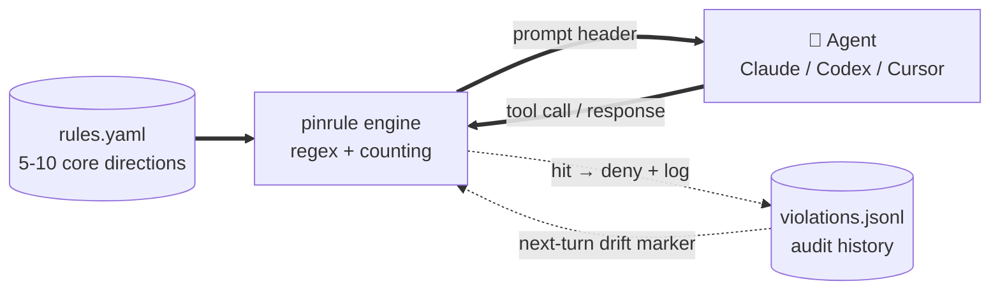
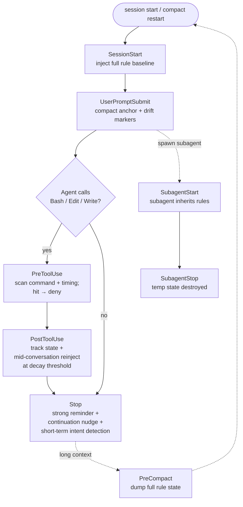

# pinrule

**[🇬🇧 English (current)](./README.md) · [🇨🇳 中文](./README.zh.md)**

[](https://github.com/jhaizhou-ops/pinrule/actions/workflows/ci.yml)
[](https://www.python.org/)
[](LICENSE)
[](https://github.com/jhaizhou-ops/pinrule/actions)
[](https://github.com/jhaizhou-ops/pinrule/releases)
[](https://github.com/jhaizhou-ops/pinrule/commits/main)

> **Pin the 5-10 rules your AI must not drift from during long tasks. Pure engineering, zero LLM, ~50-70ms hook latency, ~2% token overhead in typical dogfood.**


> 5-scene animated SVG (~20s loop): **(1)** compact anchor injected on every user prompt, **(2)** real-time block on UI-stalling commands, **(3)** Agent shortcut attempt caught ("Let me just hardcode this case"), **(4)** Agent silent stop → nudge to keep pushing, **(5)** long-context accumulation → mid-conversation full rule reinject (auto-detects each model's decay point) — all real screencaps, no manual mocks.

Andrej Karpathy's [CLAUDE.md](https://github.com/forrestchang/andrej-karpathy-skills) teaches AI how to write good code. pinrule solves the other half — how to keep AI from drifting off your rules in long tasks, and how violations get caught and corrected before they pile up.
>
**Two sides of the same loop**:

🛡️ **Pin your rules → Agent stays aligned.** Real-time hook checks before tool calls; survives compact, locale switches, and backend switches.

✨ **Say it in plain words → pinrule writes the rule.** Type `/pinrule <natural language>` in Claude / Codex (or `.cursor/skills/pinrule/` per-project for Cursor) and the pinrule skill rephrases your intent into the validated "collaborative agreement" tone, previews the injection text, confirms with you, then writes to `rules.yaml`.

Chinese + English auto-detected — open an issue if you'd like other languages supported.

**Supported clients**: Claude / Codex / Cursor agent runtimes. CLI and desktop coverage depends on each client's hook runtime — see the [backend capability matrix](./docs/ARCHITECTURE.md#backend-capability-matrix) in ARCHITECTURE.md for the per-client surface.

---

**Table of contents**: [Agents' honest take](#agents-honest-take) · [Real problems](#real-problems-you-face) · [Quick install](#zero-dependency-pure-engineering-10-second-install) · [How it fits together](#how-it-fits-together) · [`/pinrule` natural-language rule input](#pinrule-natural-language--agent-writes-the-rule-for-you) · [Usage effects](#usage-effects) · [Performance](#performance) · [Hook support](#claude--codex--cursor-native-hook-support) · [What pinrule doesn't do](#tried-and-rejected-what-pinrule-doesnt-do) · [Honest boundaries](#honest-tool-boundaries) · [FAQ](#faq) · [Mental model](#mental-model) · [Docs](#documentation)

---

## Agents' honest take

> **Claude (Opus 4.7)**: Like having a senior tech director reviewing every one of my actions in real time — tiring, but it really delivers. A lot of what I did well in this session got slapped into shape by pinrule + the user together; without those two layers, my output would have a lot more behavior-the-user-didn't-want and lazy excuses.
>
> **Codex (GPT 5.5)**: I noticed myself being "behaviorally nudged," but I didn't strongly feel "blocked or interrupted."
>
> *— That actually matches pinrule's current positioning: most of the time it sits like guardrails + background reminder noise, it only speaks up when you actually hit a rule.*

---

## Real problems you face

| Real pain | Failure scene | How pinrule solves |
|---|---|---|
| **"I said use long-term solutions, not patches" — 30 turns later the Agent patches again** | Turn 1: you say "use the cleanest solution," Agent answers "got it." Turn 50: "let me patch this quickly." Your preference got diluted by new content. | Full rule baseline at session start + compact anchor (rule ids + drift markers) on every turn header — the Agent's first attention is on your directions, and any rule that drifted last turn gets marked so it self-corrects |
| **"I said don't block the frontend — keep working while tests run" — Agent runs `sleep` anyway** | Agent runs `sleep 30`, UI blocks for 30s, you watch the progress bar — Agent never realized this is "stuck waiting" | Real-time block of `sleep` / `wait` / long tasks without background mode, hit → deny before tool runs |
| **After compact the Agent compressed my preferences into vague words** | At 80K context, compact triggers; after SessionStart, Agent compresses "no patches" into "write clean code," intent lost | Auto-dump full rule state pre-compact; auto-reload + strong-inject post-compact restart |
| **Long context accumulation → attention decay → Agent drifts** | At 60-80K accumulated context, headers get diluted — Agent isn't ignorant, attention decayed | Per-model adaptive threshold (different decay points per model), auto-reinject mid-conversation when accumulation hits threshold |
| **Agent sees a reminder → reacts defensively or rationalizes around it** | LLMs trained to please users — when faced with a violation reminder, the first reaction is to self-justify or find the shortest patch around it, not to genuinely correct | Rephrase rule tone as "collaborative agreement" tone. The Agent reads "the user you're working with hopes…" and switches to "let me realign" instead of "let me defend" |
| **Agent finishes one small step, then stops to ask "what's next?" (you're fully delegating)** | You give a clear direction → Agent finishes step 1 → "What should I do next?" → you come back from other work and find the Agent has been idle for 30 minutes | Stop hook catches silent stops and injects a continuation nudge — up to 2 in a row, then it lets the Agent saturate if it genuinely is stuck |
| **"I want to add a rule but writing yaml is heavy / my phrasing doesn't change Agent behavior"** | You know what behavior you want, but writing the rule is its own chore — wrong `violation_keywords` format triggers false positives, wrong tone makes the Agent defensive | Type `/pinrule <natural language>` in Claude / Codex (or `.cursor/skills/pinrule/` per-project for Cursor) — the pinrule skill refines tone, formats keywords, detects overlap with existing rules, previews the injection, confirms with you, then writes. ~30 seconds end-to-end |

---

## Zero-dependency pure engineering, 10-second install

**One-liner (recommended)**:

```bash
pip install pinrule && pinrule init && pinrule install-hooks
```

Restart Claude / Codex / Cursor — all hook positions + default rules take effect immediately.
For custom rules, just type `/pinrule <natural-language rule>`.

<details>
<summary>From source (dev / contributors)</summary>

```bash
git clone https://github.com/jhaizhou-ops/pinrule.git ~/pinrule
cd ~/pinrule && python -m venv .venv && .venv/bin/python -m pip install -e .
.venv/bin/pinrule init && .venv/bin/pinrule install-hooks
```
</details>

### Or ask your AI client to install it

Paste this to Claude / Codex / Cursor:

```
Install pinrule (github.com/jhaizhou-ops/pinrule) — a lightweight hook system that keeps my core direction preferences from being lost in long tasks.
Steps:
1. pip install pinrule
2. Run `pinrule init` to initialize the default rule template
3. Run `pinrule install-hooks` to install for my current client
4. Run `pinrule doctor` to verify installation
```

After install, the Agent shows a summary of default rules — you see at a glance which 7 rules are active. To modify any rule afterward, tell the Agent "remove pinrule rule X" / "change pinrule rule Y" — it knows to use the `/pinrule` skill.

### Per-client manual install commands

| Client | Install command | Note |
|---|---|---|
| Claude | `pinrule install-hooks` (default) | Takes effect immediately |
| Codex | `pinrule install-hooks --backend codex` | Auto-trusts pinrule wrappers via Codex `trusted_hash` — no manual `/hooks` approval. Details in [docs/CODEX_BACKEND.md](./docs/CODEX_BACKEND.md). |
| Cursor | `pinrule install-hooks --backend cursor` | Cursor 1.7+ required. Hooks fire on every Agent session — restart Cursor after install. `/pinrule` skill is **project-scoped only** (Cursor doesn't expose home-level global skills); see post-install notes for how to copy `SKILL.md` per project. |

### Uninstall

```bash
pinrule uninstall-hooks                                          # Remove hooks
cp ~/.claude/settings.json.before-pinrule ~/.claude/settings.json # Restore original
```

---

## Usage effects

After install + restart, here's what you'll see pinrule doing automatically:

### 1. Session-start baseline + compact anchor every turn

**Once per session** (`SessionStart` hook), pinrule injects the full rule baseline — your 5-10 directions in full prose, each tagged with its `[rule-id]`. The Agent reads them at the conversation top:

```
[pinrule — Your long-term agreement with the user]
You're collaborating with a real human user who listed several
long-term priorities. This isn't rules and isn't a judgment — these
are the collaborative agreements they hope to build with you.

1. [long-term-fundamental] The user trusts you to dig into root causes...
2. [non-blocking-parallel] When sleep / wait / long tasks are running...
3. [chinese-plain-no-jargon] Your user is non-technical — they want...
```

**Every prompt after** (`UserPromptSubmit` hook), only a compact anchor goes in — rule ids + one-line gist + a marker on any rule that drifted in the last response. Most turns this is a tiny refresher, often empty when nothing drifted:

```
[pinrule — Long-term agreement reminder (compact; full preferences in session baseline)]

1. [long-term-fundamental] Dig into root causes — pause and think
   "what's the cleanest solution?" before patching
   〔Last response had drift on this one — let's realign this turn〕
2. [non-blocking-parallel] sleep / wait blocks — Agent should
   run_in_background and pick up the next thing
3. [chinese-plain-no-jargon] Non-technical user; swap jargon for
   plain Chinese, save technical terms for their first use
```

Why split the two: the full baseline (~1.8K tokens) only loads once at session start; per-turn anchor averages ~490 tokens (often 0 when no rule drifted) — **net ~73% per-turn token saving** vs re-sending everything every turn.

### 2. Mid-conversation refresh when context accumulates

LLM attention decays in long contexts — header content gets diluted by everything that came after it. pinrule tracks accumulation per tool call, and once the current model's decay point is hit (each model has its own), injects a concise refresh right at the boundary:

```
[pinrule — After long context, recall the agreement with the user]
Context has accumulated for a while. Reminding you of the
long-term priorities (no need to respond, just refresh in mind
to avoid future drift):
  ▸ long-term-fundamental: The user trusts you to dig into root causes...
  ▸ non-blocking-parallel: When sleep / wait / long tasks are running...
  ▸ chinese-plain-no-jargon: Your user is non-technical...
```

### 3. Real-time check before tool calls

Before the Agent runs Bash / Edit / Write, pinrule scans command content, keywords, **and behavioral timing across the session**. A hit denies the tool call with a targeted suggestion:

```
$ Bash sleep 30
pinrule ⚠️: 'non-blocking-parallel' violation — sleep periods make the user
        feel "stuck." Use run_in_background=True; the task completion
        will notify you, freeing you to do the next thing.
[permission deny]
```

pinrule also catches **behavioral timing**, not just single commands. Example: tests failed → Agent immediately edits a file it never read this session. Classic "shallow patch" pattern (no looking at source before changing):

```
$ Edit /workspace/src/foo.py
pinrule ⚠️: 'deep-fix-not-bypass' violation — editing foo.py right after
        test failure but you haven't Read it this session. Read the
        source first to find the real root cause; the issue may be
        upstream rather than at the patch site.
[permission deny]
```

### 4. Subagent coverage

When the main Agent spawns a subagent via the Task tool, pinrule injects the full rule set there too, with its own monitoring state. The subagent is held to the same standard as the main Agent; state cleans up on completion so it doesn't bleed into the main session.

### 5. Survives compact

When the client auto-compacts a long session, pinrule dumps the full rule state to disk first. After the post-compact restart, it reads the snapshot back and re-injects — rules don't get summarized into vague paraphrases.

### 6. Silent-stop nudge + short-term intent detection

When the Agent finishes a wave and tries to stop with "what's next?", pinrule catches it and injects a continuation nudge:

```
[pinrule — Your last response showed no next-step signal]
The user is fully-delegating — they expect you to immediately
continue after finishing a wave. If you need their judgment, ask
clearly; if you're truly saturated, say where you're stuck — don't
silently wait.
(Reminder 1/2)
```

Up to 2 nudges in a row. If the Agent is genuinely saturated and says where it's stuck, pinrule backs off — it won't force-push past real saturation.

pinrule also reads the Agent's **whole turn output** at Stop time and catches short-term intent declarations — the patch-instead-of-root-cause language pattern:

```
Agent: "Let me just hardcode this case for now and ship it."
pinrule ⚠️: 'long-term-fundamental' violation — declaring a short-term
        intent contradicts the user's expectation of root-cause work.
        Pause and ask: is the cleanest solution the user would want
        worth a few more minutes of thought?
```

The check is combo-pattern based (intent prefix + short-term action verb within 12 chars), not raw keyword matching — so reflective phrases like "short-term patches won't work, dig the root cause" pass through cleanly.

---

## `/pinrule <natural language>` — Agent writes the rule for you

This is pinrule's other half — the **partner** side, not the **monitor** side.

```
You (in Claude):   /pinrule When I say "done" I want test pass evidence attached
                        Don't accept vague "should work" claims.

Agent (pinrule skill walks 7 steps automatically):
  ① Understand intent — flags anchor-vs-scope ambiguity if any
  ② Check existing rules — semantic overlap detection (modify vs add)
  ③ Draft yaml inline — collaborative-agreement tone, locale-aware
  ④ pinrule rule preview — schema + REGISTRY validation
  ⑤ Confirm with you — adjust wording / keywords / engine-check
  ⑥ pinrule rule add — atomic write to rules.yaml
  ⑦ Report — count, takes-effect timing, redundancy suggestions

→ 30 seconds end-to-end, rule live on next UserPromptSubmit.
```

> **Type `/pinrule` with no arguments** anytime to see the interception dashboard — which engine checks are firing most, real-vs-false-positive distribution, keyword-only fallback share. The Agent reads the data and tells you which directions the Agent violates most in your sessions, so you can decide whether to add or drop a rule.

---

## How it fits together



`rules.yaml` is the only thing you maintain. The engine reads it, injects at the right hook points, and watches Agent traffic for drift — no retrieval, no scoring, no LLM in the loop.

---

## Performance

| Dimension | Number | Note |
|---|---|---|
| **Runtime dependencies** | Zero | Just PyYAML — a 15-year mature Python standard. No LLM API key, no network calls, no ML framework |
| **Source code** | ~9.7K lines Python | Readable, modifiable, no magic |
| **Quality gates** | lint / type-check / dead-code / **854 unit tests**, all green (CI: 4 matrix jobs ubuntu+macos × py3.11+3.12) | Plus continuous real-world dogfooding |
| **Hook latency** | typically 50-70ms (Python startup-bound, machine-dependent — author's M-series Mac ~49ms, 67ms reported on lower-end machines). Reproduce on your machine: `python scripts/measure_perf.py` | Well within AI client protocol budget of 200ms |
| **Token cost** | 1.8K SessionStart baseline + per-turn anchor listing only session-violated rules + auto-refresh at model decay threshold (Opus 60K / Sonnet 40K / Haiku 30K) | **Real dogfood: ~2% of conversation context** (30 sessions measured: 60% of work sessions = 0 anchor token, median 1 violated rule per session) |
| **Supported clients** | Claude / Codex / Cursor | Add a backend via [HOWTO](./pinrule/backends/HOWTO.md) |

---

## Claude / Codex / Cursor native hook support

Native hook coverage on all 3 backends — **Claude 8 events, Codex 6 events, Cursor 12 events**, all wired end-to-end. Diagram below uses Claude's 8-event lifecycle as example; for the per-backend event mapping see the [backend capability matrix](./docs/ARCHITECTURE.md#backend-capability-matrix) in ARCHITECTURE.md.



All hook outputs strictly comply with the AI client's official protocol schema — no UI error messages. Per-backend event mapping in [ARCHITECTURE.md](./docs/ARCHITECTURE.md#backend-capability-matrix).

---

## Tried and rejected (what pinrule doesn't do)

Several ideas looked attractive but failed in practice. Recorded here so the same alleys don't get re-walked:

| Tried | Why it was rejected |
|---|---|
| **LLM auto-distilling new rules** | Latency hurts UX, and auto-distilled rules introduce noise — hearing a user say something once doesn't mean it's a core direction. pinrule keeps users in charge of their 5-10 rules instead |
| **Retrieval / cosine recall** | The real pain is "persistence," not "recall" — 5-10 rules can all be always-on, no selection needed. Retrieval adds latency and matching errors with no upside |
| **More than 12 rules** | Beyond ~12, LLMs pattern-match "a rule list exists" instead of reading it (see [Mnilax's 30-codebase empirical study](https://x.com/Mnilax/status/2053116311132155938) for the compliance cliff). Keeping the count under 10 is the empirically safe zone |
| **Competing with memory systems** | "Facts / preferences about the user" belong in the AI client's built-in memory. pinrule only does the one thing memory systems don't: pin behaviors you've already repeated |
| **Reshipping pinrule as an MCP server** | pinrule works because hooks are *enforced* by the client (UserPromptSubmit fires whether the Agent likes it or not). MCP servers expose tools the Agent *chooses* to call — in long-session attention decay, the Agent doesn't proactively query "what rules apply here," it drifts first and gets corrected by hooks. MCP-only would lose the core enforcement guarantee |

---

## Honest tool boundaries

pinrule is **regex matching + counting**, not LLM semantic understanding. That means:

- **False positives happen.** Table cells quoting a term, `python -c` string literals, commit messages describing a violation — all can hit the regex. `pinrule audit` flags suspected false positives with "⚠️ possible false positive" so you can report them
- **False negatives happen.** Regex can't tell when a user is intentionally disguising a violation. pinrule assumes you're not cheating yourself
- **Zero triggers after a fix doesn't prove the fix is correct.** The pattern might just be too wide, swallowing real cases. Audit numbers are hints, not ground truth

Think of pinrule as sitting between `git` and a linter — it gives signals, you make decisions.

---

## FAQ

<details>
<summary><b>Nothing happens after install?</b></summary>

Run `pinrule doctor` to check:
- Are all hook events ✓? (Claude 8 / Codex 6 / Cursor 12)
- Did rules load successfully?
- Did session state directory generate new files?
</details>

<details>
<summary><b>Too many false positives, what to do?</b></summary>

`pinrule audit` shows triggers marked "⚠️ possible false positive" — report to the author (GitHub Issue). Temporarily disable a rule: `pinrule rule remove <id>` or edit `~/.pinrule/rules.yaml` and remove `violation_keywords` / `violation_checks` fields while keeping `preference`.
</details>

<details>
<summary><b>Does this overlap with Andrej Karpathy's CLAUDE.md?</b></summary>

**Completely complementary, no overlap**:
- Karpathy's 12 rules ([complete version](https://github.com/forrestchang/andrej-karpathy-skills)) are **universal coding principles** (cross-user, cross-project): "Think before coding," "Simplicity first," etc.
- pinrule's rules are **per-user personal preferences** (each user differs): "I prefer Chinese over jargon," "I want full-delegation," etc.

**Recommended setup**: install Karpathy's 12 rules in CLAUDE.md (project-shared) + install your personal rules via pinrule (user-level). They run on the same AI client without conflict.
</details>

<details>
<summary><b>How is pinrule different from mem0 / Claude's built-in memory?</b></summary>

**Different jobs, not competitors**:

| Tool | Job | When it fires |
|---|---|---|
| **Memory systems** (mem0, Claude/ChatGPT memory) | Store *facts* about the user — preferences, history, profile traits | Agent *chooses* to query when relevant |
| **pinrule** | Enforce *behaviors* you've already articulated as long-term directions | Hooks fire automatically on every prompt + before every tool call |

Memory systems are good at "remember the user said X last week." pinrule is good at "the user's 7 core directions get *injected* at session start + reinforced via compact per-turn anchors whether the Agent retrieves them or not — and violations get caught in real-time."

You can (and should) use both. Memory holds "user prefers TypeScript over JavaScript"; pinrule holds "this user's directional preferences are non-negotiable and enforced via hooks."

pinrule explicitly does **not** compete with memory systems — the [Tried and rejected](#tried-and-rejected-what-pinrule-doesnt-do) section locks this in as a permanent boundary.
</details>

<details>
<summary><b>Custom rule sets for non-development scenarios (writing / research / legal)?</b></summary>

`pinrule init` defaults to "software development" scenario. For other scenarios, write `~/.pinrule/rules.yaml` manually — the framework (hook injection / real-time interception) is cross-scenario universal, but the 8 built-in `violation_checks` are dev-oriented. Other scenarios may need preference text reminders + custom keywords (without check functions).
</details>

<details>
<summary><b>How do I sync rules across multiple devices?</b></summary>

Just ask the Agent to copy `rules.yaml` over — no special tooling needed:

```
mac:    cat ~/.pinrule/rules.yaml
linux:  "here's my pinrule rules.yaml, write it to ~/.pinrule/rules.yaml"
linux:  pinrule doctor    # validate schema + rules count + violation_checks exist
```

**Safe to sync** (user preference config):
- `~/.pinrule/rules.yaml` — your rule definitions
- `~/.pinrule/config.yaml` — your threshold tuning (if customized)

**Never sync** (runtime data, per-device):
- `~/.pinrule/violations.jsonl` — append-only per-device violation log
- `~/.pinrule/session-state/*.json` — runtime hook state

pinrule's cross-process atomicity protects same-machine concurrency, but **doesn't extend to cloud-synced folders** (iCloud / Dropbox / OneDrive). Putting `~/.pinrule/` in a sync folder can corrupt runtime state across devices. If you use dotfiles repos / chezmoi / ansible, scope them to `rules.yaml` + `config.yaml` only.
</details>

---

## Mental model

> A rules file isn't a wishlist. It's a behavioral contract closing out specific failure modes you've observed. Each rule should answer: **what error is this rule preventing?**

pinrule works the same way. **6 rules targeting failures you've actually hit beats 12 rules where 6 are aspirational.**

The 7 default rules in `data/rules.dev.example.yaml` are real pain points accumulated from self-use — they aren't a template to copy verbatim. After install, run `pinrule rule list`, keep what matches your own failure scenes, and replace the rest with your own (via `/pinrule <natural language>`).

---

## Documentation

All listed docs are bilingual (`.md` English + `.zh.md` Chinese):

- [docs/PRD.md](./docs/PRD.md) — Product requirements, validation criteria, scenario positioning
- [docs/ARCHITECTURE.md](./docs/ARCHITECTURE.md) — Technical architecture, hook protocol, 8 check implementations
- [CHANGELOG.md](./CHANGELOG.md) — Version change history (bilingual from v0.5.1 onward; pre-v0.5.1 release notes are Chinese-only)
- [docs/HANDOFF.md](./docs/HANDOFF.md) — Internal development handoff entry (English summary; full timeline in `.zh.md`)
- [docs/CODEX_BACKEND.md](./docs/CODEX_BACKEND.md) — Codex backend ownership boundary and 8-method contract
- [CLAUDE.md](./CLAUDE.md) — Project charter for Claude collaboration

Translation PRs welcome for any bilingual gap (HANDOFF.md still summary-only).

## Acknowledgments

- [Andrej Karpathy's CLAUDE.md coding-principles template](https://github.com/forrestchang/andrej-karpathy-skills) — universal coding principles. Complementary to pinrule, not competing: Karpathy teaches the model *how* to write code; pinrule keeps your *preferences* from drifting in long tasks
- [Mnilax's 30-codebase 6-week CLAUDE.md rule-count study](https://x.com/Mnilax/status/2053116311132155938) — pinrule's "soft cap 10 / hard cap 12" design comes directly from this empirical work

## Contributing

- Bug reports / suggestions: [GitHub Issues](https://github.com/jhaizhou-ops/pinrule/issues)
- Add a new AI client backend: see [pinrule/backends/HOWTO.md](./pinrule/backends/HOWTO.md)
- Add scenario rule templates (writing / research / legal etc.): PR welcome to `data/`

pinrule is still early — new-user install friction and first-week false positives drive most of the iteration.

## License

MIT
