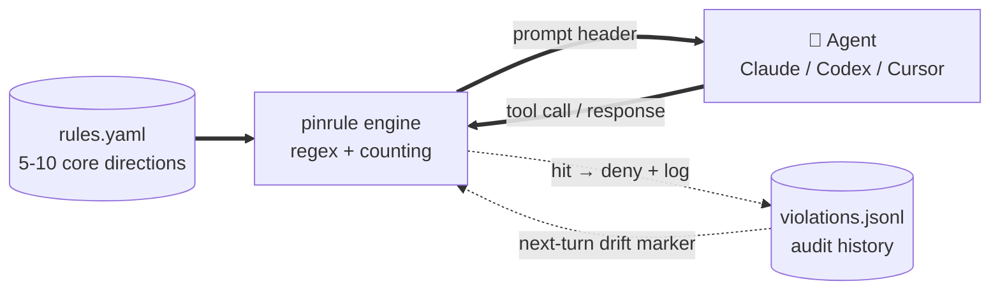

# pinrule

**[🇬🇧 English (current)](./README.md) · [🇨🇳 中文](./README.zh.md)**

[](https://github.com/jhaizhou-ops/pinrule/actions/workflows/ci.yml)
[](https://www.python.org/)
[](LICENSE)
[](https://github.com/jhaizhou-ops/pinrule/actions)
[](https://github.com/jhaizhou-ops/pinrule/releases)
[](https://github.com/jhaizhou-ops/pinrule/commits/main)

> **Pin the 5-10 rules your AI must not drift from during long tasks.**
> Pure engineering · zero LLM · ~50-70ms hook · ~2% token overhead in typical dogfood.


Andrej Karpathy's [CLAUDE.md](https://github.com/forrestchang/andrej-karpathy-skills) teaches your AI *how* to write good code. pinrule keeps your AI *aligned with your personal preferences* in long tasks — what to never do, what to always do, what to push back on — so you don't have to repeat yourself every 30 turns.

---

## Quick start

```bash
pip install pinrule && pinrule init && pinrule install-hooks
```

Restart Claude / Codex / Cursor — default rules become active once hooks load. To add a personal rule:

```
/pinrule When I say "done" I want test pass evidence attached.
```

The skill refines, validates, confirms with you, then writes — ~30 seconds.

---

## What pinrule does

- **Injects** your 5-10 directions at session start, compact anchor each turn, full reinject on long-context decay.
- **Blocks drift in real time** — Bash `sleep`, Edit-before-Read, "let me hardcode this" intent declarations all caught before they ship.
- **Survives compact** — dumps full rule state pre-compact; reloads + re-injects post-restart.

Per-hook lifecycle: see [ARCHITECTURE.md](./docs/ARCHITECTURE.md#backend-capability-matrix).

---

## How it fits together



`rules.yaml` is the only thing you maintain. The engine reads it, injects at the right hook points, watches Agent traffic for drift — no retrieval, no scoring, no LLM in the loop.

---

## Not just another AI memory tool

| Tool category | What it stores | When it fires |
|---|---|---|
| **Memory** (mem0, Claude memory) | Facts about you (preferences, history, profile) | Agent chooses to query |
| **pinrule** | Behaviors you've articulated as long-term directions | Hooks fire automatically every prompt + every tool call |

Use both. Memory holds "I prefer TypeScript"; pinrule enforces "non-negotiable directions, hook-enforced."

---

## Performance

| | |
|---|---|
| **External deps** | 0 (only PyYAML, a Python-standard library) |
| **Hook latency** | ~50-70ms typical (machine-bound; reproduce via `scripts/measure_perf.py`) |
| **Token overhead** | ~2% of conversation context in real dogfood (methodology: [docs/EVALUATION.md](./docs/EVALUATION.md)) |
| **Tests** | 800+ unit tests, [green on 6-matrix CI](https://github.com/jhaizhou-ops/pinrule/actions/workflows/ci.yml) (ubuntu + macOS + Windows × Python 3.11 / 3.12) |
| **Supported clients** | Claude / Codex / Cursor — [add a backend](./pinrule/backends/HOWTO.md) |

---

## Per-client install + uninstall

| Client | Command | Note |
|---|---|---|
| Claude (default) | `pinrule install-hooks` | — |
| Codex | `pinrule install-hooks --backend codex` | — |
| Cursor 1.7+ | `pinrule install-hooks --backend cursor` | `/pinrule` skill is project-scoped only |

```bash
pinrule uninstall-hooks                                          # remove
cp ~/.claude/settings.json.before-pinrule ~/.claude/settings.json # restore
```

Codex details: [docs/CODEX_BACKEND.md](./docs/CODEX_BACKEND.md). Cursor's `/pinrule` skill is project-scoped (Cursor doesn't expose home-level global skills) — see post-install hint.

---

## Tried and rejected

Several ideas looked attractive but failed in practice. Recorded so the same paths don't get re-walked:

| Tried | Why rejected |
|---|---|
| **LLM auto-distilling new rules** | Latency + noise. Hearing something once doesn't make it a long-term direction. |
| **Retrieval / cosine recall** | The pain is "persistence," not "recall" — 5-10 rules can be always-on. |
| **More than 12 rules** | LLMs pattern-match "a rule list exists" instead of reading it ([Mnilax's 30-codebase study](https://x.com/Mnilax/status/2053116311132155938)). |
| **Reshipping as MCP server** | Hooks are *enforced*; MCP tools are *chosen*. In long-session decay, the Agent drifts before it asks "what rules apply." |

---

## Honest tool boundaries

pinrule is **regex + counting**, not LLM semantic understanding.

- **False positives happen.** Table cells quoting a term, `python -c` literals, commit messages — all can hit. `pinrule audit` flags suspected false positives.
- **False negatives happen.** Regex can't tell if you're disguising a violation. pinrule assumes you're not cheating yourself.
- **Zero hits after a fix doesn't prove the fix is correct.** The pattern might just be too wide.

Sits between `git` and a linter — signals, not verdicts.

---

## FAQ

<details>
<summary><b>Nothing happens after install?</b></summary>
Run <code>pinrule doctor</code> — checks hook events, rule loading, session state.
</details>

<details>
<summary><b>Too many false positives?</b></summary>
<code>pinrule audit</code> shows triggers tagged "⚠️ possible false positive" — report via Issue. Disable a single rule: <code>pinrule rule remove &lt;id&gt;</code>, or edit <code>~/.pinrule/rules.yaml</code> and remove its <code>violation_keywords</code> / <code>violation_checks</code> fields.
</details>

<details>
<summary><b>Custom rule sets for non-dev scenarios (writing / research / legal)?</b></summary>
The framework is cross-scenario; the 8 built-in <code>violation_checks</code> are dev-oriented. Write your own <code>rules.yaml</code> for other scenarios — preference text + custom keywords (no engine check needed).
</details>

<details>
<summary><b>How do I sync rules across devices?</b></summary>
Ask the Agent to copy <code>~/.pinrule/rules.yaml</code>. <b>Safe to sync</b>: <code>rules.yaml</code> + <code>config.yaml</code>. <b>Never sync</b>: <code>violations.jsonl</code>, <code>session-state/</code> (runtime data, per-device — cloud-synced folders can corrupt cross-device state).
</details>

<details>
<summary><b>Does this overlap with Karpathy's CLAUDE.md?</b></summary>
Complementary. Karpathy's 12 rules are <b>universal coding principles</b> (cross-user). pinrule's are <b>personal preferences</b> (per-user). Use both.
</details>

---

## What Agents say after running pinrule

> **Claude (Opus 4.7)**: Like having a senior tech director reviewing every action in real time — tiring, but it delivers. Without pinrule, a lot more behavior-the-user-didn't-want would have shipped.
>
> **Codex (GPT 5.5)**: I noticed myself being "behaviorally nudged," but didn't strongly feel "blocked or interrupted."
>
> *— Matches pinrule's positioning: guardrails + background noise, speaking up only when you hit a rule.*

---

## Mental model

> A rules file isn't a wishlist. It's a behavioral contract closing out failure modes you've actually observed. Each rule should answer: **what error is this rule preventing?**

The 7 default rules in `data/rules.dev.example.yaml` are pain points from self-use, not a template to copy verbatim. Keep what matches your own failure scenes, replace the rest via `/pinrule <natural language>`.

---

## Documentation

- [PRD.md](./docs/PRD.md) — product requirements + scenario positioning
- [ARCHITECTURE.md](./docs/ARCHITECTURE.md) — hook protocol, 8 check implementations, sandbox model
- [HOOK_CONFIGURATION_GUIDE.md](./docs/HOOK_CONFIGURATION_GUIDE.md) — per-hook lifecycle + tunable thresholds
- [EVALUATION.md](./docs/EVALUATION.md) — methodology behind performance numbers (hook latency, token overhead)
- [CHANGELOG.md](./CHANGELOG.md) — release notes (grouped by minor version)
- [CODEX_BACKEND.md](./docs/CODEX_BACKEND.md) — Codex backend ownership boundary
- [CLAUDE.md](./CLAUDE.md) — project charter for Claude collaboration

All bilingual (`.md` English + `.zh.md` Chinese).

## Acknowledgments

- [Andrej Karpathy's CLAUDE.md template](https://github.com/forrestchang/andrej-karpathy-skills) — universal coding-principles companion to pinrule's personal preferences.
- [Mnilax's 30-codebase 6-week CLAUDE.md study](https://x.com/Mnilax/status/2053116311132155938) — pinrule's soft cap 10 / hard cap 12 comes from this.

## Contributing

- Bugs / ideas: [GitHub Issues](https://github.com/jhaizhou-ops/pinrule/issues)
- Add a new AI client backend: [HOWTO](./pinrule/backends/HOWTO.md)
- Scenario rule templates: PR to `data/`

## License

MIT
