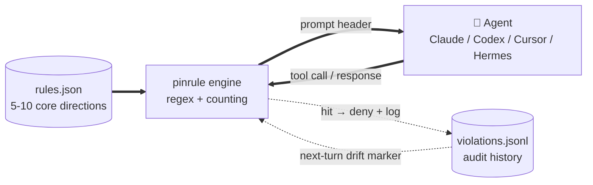

# pinrule

**[🇬🇧 English (current)](./README.md) · [🇨🇳 中文](./README.zh.md)**

[](https://github.com/jhaizhou-ops/pinrule/actions/workflows/ci.yml)
[](https://www.python.org/)
[](LICENSE)
[](https://github.com/jhaizhou-ops/pinrule/actions)
[](https://github.com/jhaizhou-ops/pinrule/releases)
[](https://github.com/jhaizhou-ops/pinrule/commits/main)

**Pin the 5-10 rules your AI must not drift from during long tasks.** Ships with a 7-rule dev preset; switch to any other scenario with one sentence: `/pinrule I mainly do X, switch to this scenario`.

> **Runtime**: pure engineering · zero LLM · zero network · zero runtime deps · ~50-70ms hook · ~2% token overhead. (Scenario rule pack generation runs in your Agent — see Path B below.)


Andrej Karpathy's [CLAUDE.md](https://github.com/forrestchang/andrej-karpathy-skills) teaches your AI *how* to write good code. pinrule keeps your AI *aligned with your personal preferences* in long tasks — what to never do, what to always do, what to push back on — so you don't have to repeat yourself every 30 turns.

---

## Quick start

### Let your Agent install it (recommended — least friction)

Since you're already using Claude Code / Codex / Cursor (otherwise you wouldn't need pinrule), paste this prompt to your Agent:

```
Install pinrule (github.com/jhaizhou-ops/pinrule) — a universal AI behavior rule
framework that keeps my long-task rules from being lost. Steps:

1. Verify Python is actually installed (Windows: run `python --version` — if it
   silently exits to Microsoft Store, first `winget install Python.Python.3.12`
   and reopen PowerShell). Use `python -m pinrule` form on Windows to avoid PATH issues.
2. pip install pinrule
3. pinrule init      # auto-installs default rules + hooks for every detected client
4. pinrule doctor    # verify install
5. Show me the 7 default rules + how to add my own via /pinrule
```

The Agent figures out your OS, Python state, and which clients you have. After install, restart your client and rules take effect.

### Manual install

```bash
pip install pinrule && pinrule init
```

`pinrule init` auto-installs hooks for any detected client (Claude / Codex / Cursor / Hermes) + writes default rules to `~/.pinrule/`. If you install a new client later, run `pinrule install-hooks` to wire it up.

Restart Claude / Codex / Cursor / Hermes — default rules become active once hooks load.

**Uninstall** — `pinrule uninstall-hooks` (auto-removes pinrule entries from every detected client surgically; doesn't touch hooks installed by other tools).

> **Windows without Python**: `python --version` silently jumping to Microsoft Store means no real Python — install via `winget install Python.Python.3.12`, reopen PowerShell, then use `python -m pip install pinrule && python -m pinrule init` (the `python -m` form avoids needing `Scripts\` on PATH).

---

## What pinrule does

- **Injects** your 5-10 directions at session start, compact anchor each turn, full reinject on long-context decay.
- **Blocks drift in real time** — Bash `sleep`, Edit-before-Read, "let me hardcode this" intent declarations all caught before they ship.
- **Survives compact** — dumps full rule state pre-compact; reloads + re-injects post-restart.

Per-hook lifecycle: see [ARCHITECTURE.md](./docs/ARCHITECTURE.md#backend-capability-matrix).

---

## How it fits together



`rules.json` is the only thing you maintain. The engine reads it, injects at the right hook points, watches Agent traffic for drift — no retrieval, no scoring, no LLM in the loop.

---

## Not just another AI memory tool

| Tool category | What it stores | When it fires |
|---|---|---|
| **Memory** (mem0, Claude memory) | Facts about you (preferences, history, profile) | Agent chooses to query |
| **pinrule** | Behaviors you've articulated as long-term directions | Hooks fire automatically every prompt + every tool call |

Use both. Memory holds "I prefer TypeScript"; pinrule enforces "non-negotiable directions, hook-enforced."

---

## Performance

| | |
|---|---|
| **Runtime deps** | 0 (Python stdlib only — JSON, no third-party packages) |
| **Rule count** | 7 default (dev-scenario preset) · soft cap 10 · hard cap 12 (load refused beyond) |
| **Hook latency** | ~50-70ms typical (machine-bound; reproduce via `scripts/measure_perf.py`) |
| **Token overhead** | ~2% of conversation context in real dogfood (methodology: [docs/EVALUATION.md](./docs/EVALUATION.md)) |
| **Tests** | 800+ unit tests, [green on 6-matrix CI](https://github.com/jhaizhou-ops/pinrule/actions/workflows/ci.yml) (ubuntu + macOS + Windows × Python 3.11 / 3.12) |
| **Supported clients** | Claude / Codex / Cursor / Hermes — [add a backend](./pinrule/backends/HOWTO.md) |

---

## `/pinrule` — one command, three jobs

You only need to remember one command — `/pinrule`. Based on the natural-language content you type, the pinrule skill auto-dispatches to one of three paths, guides your Agent through tone refinement, schema validation, and monitoring wiring, then writes to your rule library after your confirmation.

| You type | Routes to | Wall time |
|---|---|---|
| **`/pinrule`** (no args) | **Data dashboard** — which engine checks fire most, real-vs-false-positive split | <1s (pure CLI, no LLM synthesis) |
| **`/pinrule <single rule>`** | **Path A: add / modify / remove one rule** — 7-step skill flow | ~30s |
| **`/pinrule <scenario, switch to this>`** | **Path B: scenario rule pack** — synthesize 5-7 rules from 4 signals, two-phase confirm, atomic batch write | 3-5 min |

Path A: `/pinrule When I say "done" I want test pass evidence attached` → 30s end-to-end.

Path B: see next section.

---

## Switch any work scenario in one line

Whatever your work is, your Agent researches the matching rule pack:

```
/pinrule I mainly do UX user research + interviews, switch to this scenario
```

The Agent synthesizes 4 signals into a 5-7 rule pack:

| Signal | Content |
|---|---|
| **A. Your local rule files** | `~/.claude/CLAUDE.md` / `~/.codex/AGENTS.md` / project `CLAUDE.md` / `.cursor/rules/*.mdc` |
| **B. Online best practices** | `WebSearch` finds high-star GitHub repos / industry blogs / papers |
| **H. Karpathy CLAUDE.md baseline** | Cross-scenario engineering principles |
| **S. Session context** | What you're working on right now |

Two-phase approval (content → mechanism), then atomic batch write with backup. Full walkthrough: [SKILL.md Path B](./skills/pinrule/SKILL.md).

> **Boundary**: pinrule runtime does not call LLMs or the network. Your Agent does the scenario research; pinrule validates and runs the resulting rules locally.

---

## Tried and rejected

Several ideas looked attractive but failed in practice. Recorded so the same paths don't get re-walked:

| Tried | Why rejected |
|---|---|
| **LLM auto-distilling new rules** | Latency + noise. Hearing something once doesn't make it a long-term direction. |
| **Retrieval / cosine recall** | The pain is "persistence," not "recall" — 5-10 rules can be always-on. |
| **More than 12 rules** | LLMs pattern-match "a rule list exists" instead of reading it ([Mnilax's 30-codebase study](https://x.com/Mnilax/status/2053116311132155938)). |
| **Reshipping as MCP server** | Hooks are *enforced*; MCP tools are *chosen*. In long-session decay, the Agent drifts before it asks "what rules apply." |

---

## Honest tool boundaries

pinrule is **regex + counting**, not LLM semantic understanding. Each known failure mode has a regression test you can run yourself:

| Failure mode | Evidence you can reproduce |
|---|---|
| **False positives** (table cells quoting a term, `python -c` literals, commit messages) | `pytest tests/test_check_fp_fixes_v0_16_13.py` — locks down 4 historical FP fixes (negation prefix, fenced code blocks, inline backticks, full-width punctuation). `pinrule audit` flags suspected FPs at runtime. |
| **False negatives** (Agent disguising a violation) | `pytest tests/test_false_negative_regression.py` — 30+ FN cases pinned. Regex can't read intent — pinrule assumes you're not cheating yourself. |
| **Zero hits ≠ fix correct** | Pattern may just be too wide. Cross-check with `pinrule audit` on real session data, not synthetic prompts. |

Sits between `git` and a linter — signals, not verdicts.

---

## FAQ

<details>
<summary><b>Nothing happens after install?</b></summary>
Run <code>pinrule doctor</code> — checks hook events, rule loading, session state.
</details>

<details>
<summary><b>Too many false positives?</b></summary>
<code>pinrule audit</code> shows triggers tagged "⚠️ possible false positive" — report via Issue. Disable a single rule: <code>pinrule rule remove &lt;id&gt;</code>, or edit <code>~/.pinrule/rules.json</code> and remove its <code>violation_keywords</code> / <code>violation_checks</code> fields.
</details>

<details>
<summary><b>Custom rule sets for non-dev scenarios (writing / research / legal / UX)?</b></summary>
Say <code>/pinrule I mainly do X scenario, switch to this</code>. Agent synthesizes 5-7 rules from 4 signals (your local <code>CLAUDE.md</code> / <code>AGENTS.md</code> / <code>.cursor/rules</code>, online best practices via WebSearch, Karpathy baseline, session context), previews with source attribution, two-phase confirms, atomic batch write — 3-5 min end-to-end. See <a href="#switch-any-work-scenario-in-one-line">"Switch any work scenario"</a> above.
</details>

<details>
<summary><b>How do I sync rules across devices?</b></summary>
Ask the Agent to copy <code>~/.pinrule/rules.json</code>. <b>Safe to sync</b>: <code>rules.json</code> + <code>config.json</code>. <b>Never sync</b>: <code>violations.jsonl</code>, <code>session-state/</code> (runtime data, per-device — cloud-synced folders can corrupt cross-device state).
</details>

<details>
<summary><b>Does this overlap with Karpathy's CLAUDE.md?</b></summary>
Complementary. Karpathy's 12 rules are <b>universal coding principles</b> (cross-user). pinrule's are <b>personal preferences</b> (per-user). Use both.
</details>

---

## What Agents say after running pinrule

> **Claude (Opus 4.7)**: Like having a senior tech director reviewing every action in real time — tiring, but it delivers. Without pinrule, a lot more behavior-the-user-didn't-want would have shipped.
>
> **Codex (GPT 5.5)**: I noticed myself being "behaviorally nudged," but didn't strongly feel "blocked or interrupted."
>
> *— Matches pinrule's positioning: guardrails + background noise, speaking up only when you hit a rule.*

---

## Mental model

> A rules file isn't a wishlist. It's a behavioral contract closing out failure modes you've actually observed. Each rule should answer: **what error is this rule preventing?**

The 7 default rules in `data/rules.dev.example.json` are pain points from self-use, not a template to copy verbatim. Keep what matches your own failure scenes, replace the rest via `/pinrule <natural language>`.

---

## Documentation

- [PRD.md](./docs/PRD.md) — product requirements + scenario positioning
- [ARCHITECTURE.md](./docs/ARCHITECTURE.md) — hook protocol, 8 check implementations, sandbox model
- [HOOK_CONFIGURATION_GUIDE.md](./docs/HOOK_CONFIGURATION_GUIDE.md) — per-hook lifecycle + tunable thresholds
- [EVALUATION.md](./docs/EVALUATION.md) — methodology behind performance numbers (hook latency, token overhead)
- [CHANGELOG.md](./CHANGELOG.md) — release notes (grouped by minor version)
- [CODEX_BACKEND.md](./docs/CODEX_BACKEND.md) — Codex backend ownership boundary
- [CLAUDE.md](./CLAUDE.md) — project charter for Claude collaboration

All bilingual (`.md` English + `.zh.md` Chinese).

## Acknowledgments

- [Andrej Karpathy's CLAUDE.md template](https://github.com/forrestchang/andrej-karpathy-skills) — universal coding-principles companion to pinrule's personal preferences.
- [Mnilax's 30-codebase 6-week CLAUDE.md study](https://x.com/Mnilax/status/2053116311132155938) — pinrule's soft cap 10 / hard cap 12 comes from this.

## Contributing

- Bugs / ideas: [GitHub Issues](https://github.com/jhaizhou-ops/pinrule/issues)
- Add a new AI client backend: [HOWTO](./pinrule/backends/HOWTO.md)
- Scenario rule templates: PR to `data/`

## License

MIT
