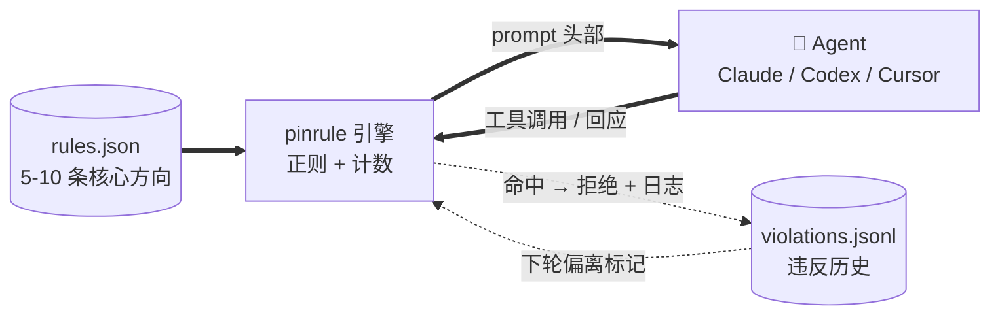

# pinrule

**[🇬🇧 English](./README.md) · [🇨🇳 中文（当前）](./README.zh.md)**

[](https://github.com/jhaizhou-ops/pinrule/actions/workflows/ci.yml)
[](https://www.python.org/)
[](LICENSE)
[](https://github.com/jhaizhou-ops/pinrule/actions)
[](https://github.com/jhaizhou-ops/pinrule/releases)
[](https://github.com/jhaizhou-ops/pinrule/commits/main)

> **把 5-10 条最重要的协作规则钉住，让 AI 在长任务里别漂。**
> 纯工程 · 零 LLM · hook 通常 50-70ms · token 占比约 2%
>
> _性能数字测自作者本人 dogfood，测量口径见 [docs/EVALUATION.zh.md](./docs/EVALUATION.zh.md)。_


Andrej Karpathy 的 [CLAUDE.md](https://github.com/forrestchang/andrej-karpathy-skills) 教 AI 怎么**写好代码**。pinrule 让 AI 在长任务里**跟你的个性化偏好对齐** — 哪些事永远别做、哪些事一定要做、哪些地方要回推 — 不用你每 30 轮对话重复一遍。

---

## 10 秒上手

```bash
pip install pinrule && pinrule init
```

`pinrule init` 在 `~/.pinrule/` 装默认规则 + 自动给所有检测到的客户端（Claude / Codex / Cursor）补装 hook。后面装了新客户端就跑 `pinrule install-hooks` 补上。

> **Windows 用户**: Windows 默认不带 Python. 如果 `python --version` 没真版本号 (silent 跳 Microsoft Store), 先装 Python:
> ```powershell
> winget install Python.Python.3.12
> # 关掉再开 PowerShell 让 PATH 刷新
> python -m pip install pinrule
> python -m pinrule init
> python -m pinrule install-hooks
> python -m pinrule doctor
> ```
> 用 `python -m pinrule` 形式不需要 Python 的 `Scripts\` 目录在 PATH 里 (Windows pip install 完默认不在 PATH).

重启 Claude / Codex / Cursor，hook 加载后默认规则立即生效。添加一条个性化规则：

```
/pinrule 我说「完成」的时候希望附上测试通过证据。
```

pinrule skill 会帮你润色规则语气、校验格式，确认后写入 `rules.json`，约 30 秒完成。

---

## pinrule 做什么

- **持续注入** 你的 5-10 条规则 — session 开始时注入完整规则；每轮对话头部带一个精简锚点（rule id + 一句核心方向 + 上一轮偏离过的规则标记）；长上下文累积到注意力衰减拐点时，自动重新注入完整规则。
- **实时拦截漂移** — Bash `sleep` / Edit 没先 Read 就改 / 「我先硬编码这个 case」类短期意图话术，都在执行前被拦下。
- **跨 compact 不丢** — 客户端 compact（自动压缩对话历史）前，pinrule 把完整规则状态落盘；重启后自动重新加载并强注入。

每个 hook 的触发位置见 [ARCHITECTURE.zh.md](./docs/ARCHITECTURE.zh.md#三端能力对照)。

---

## 整体结构



`rules.json` 是你唯一维护的东西。引擎读它，在合适的 hook 触发点注入，监视 Agent 输出找漂移 — 不做向量检索、不做评分、整个循环不调 LLM。

---

## 跟 AI memory 类工具不一样

| 工具 | 存什么 | 什么时候触发 |
|---|---|---|
| **Memory**（mem0、Claude memory） | 关于你的**事实**（偏好、历史、画像） | Agent 自己决定什么时候去查 |
| **pinrule** | 你已经说过的长期**行为方向** | hook 在每条 prompt + 每个工具调用前自动触发 |

两个可以一起用。Memory 装「我偏好 TypeScript」，pinrule 装「这些方向不让步，hook 强制执行」。

---

## 性能

| | |
|---|---|
| **运行时依赖** | 0（只用 Python 标准库 — JSON / importlib，无第三方包） |
| **规则数量** | 默认 7 条（开发场景预设）· 软上限 10 · 硬上限 12（超过拒绝加载） |
| **hook 延迟** | 通常 50-70ms（机器相关；本机复现 `scripts/measure_perf.py`） |
| **token 占比** | 真 dogfood 实测约 2%（测量口径见 [docs/EVALUATION.zh.md](./docs/EVALUATION.zh.md)） |
| **测试** | 800+ 单元测试，[CI 6 矩阵全绿](https://github.com/jhaizhou-ops/pinrule/actions/workflows/ci.yml)（ubuntu + macOS + Windows × Python 3.11 / 3.12） |
| **支持客户端** | Claude / Codex / Cursor — [加新 backend](./pinrule/backends/HOWTO.zh.md) |

---

## 各客户端装机 + 卸载

| 客户端 | 命令 | 备注 |
|---|---|---|
| Claude（默认） | `pinrule install-hooks` | — |
| Codex | `pinrule install-hooks --backend codex` | — |
| Cursor 1.7+ | `pinrule install-hooks --backend cursor` | `/pinrule` skill 仅 project-scoped（项目级） |

```bash
pinrule uninstall-hooks                                          # 拆 hook
cp ~/.claude/settings.json.before-pinrule ~/.claude/settings.json # 恢复
```

Codex 细节见 [docs/CODEX_BACKEND.zh.md](./docs/CODEX_BACKEND.zh.md)。Cursor 协议不暴露 home-level 全局 skill，需要把 `SKILL.md` 复制到每个目标项目的 `.cursor/skills/pinrule/` 下，装完会看到提示。

---

## 试过但放弃的

下面这些方向看起来吸引人，但实际跑下来都翻车 — 记下来免得重复走弯路：

| 试过 | 放弃原因 |
|---|---|
| **LLM 自动蒸馏新规则** | 延迟伤体验，自动蒸馏的规则带噪声 — 用户说过一次不代表是长期方向。 |
| **检索 / cosine 召回** | 痛点是「永驻」不是「召回」— 5-10 条规则全部 always-on 不需要选。 |
| **超过 12 条规则** | 超过 12 条后 LLM 倾向模式匹配「规则存在」而不认真读（参考 [Mnilax 30 个代码库的实证研究](https://x.com/Mnilax/status/2053116311132155938)）。 |
| **改造成 MCP server** | hook 是**强制触发**，MCP 是 Agent **主动调用** — 长 session 衰减时，Agent 不会主动 query「我现在该遵循什么」，它会先漂移，再被 hook 拦下。 |

---

## 诚实的工具边界

pinrule 是**正则匹配 + 计数**，不是 LLM 语义理解。

- **会有假阳性。** 表格里引用术语、`python -c` 字符串字面、commit message 描述违反字眼 — 都可能命中。`pinrule audit` 把疑似假阳标「⚠️ 可能假阳」。
- **会有假阴性。** 正则分不出来用户是不是故意伪装。pinrule 假设你不会拿自己开玩笑。
- **修后 0 触发不等于 fix 对。** 可能是 pattern 过宽把真 case 一并吃了。

把 pinrule 想成介于 `git` 跟 lint 之间的工具 — 给信号，不给判决。

---

## FAQ

<details>
<summary><b>装完没反应？</b></summary>
跑 <code>pinrule doctor</code> — 检查 hook 事件、规则加载、session 状态。
</details>

<details>
<summary><b>太多假阳？</b></summary>
<code>pinrule audit</code> 看「⚠️ 可能假阳」标记，提 GitHub Issue 反馈。临时关掉一条规则：<code>pinrule rule remove &lt;id&gt;</code>，或者编辑 <code>~/.pinrule/rules.json</code> 把 <code>violation_keywords</code> / <code>violation_checks</code> 字段删掉。
</details>

<details>
<summary><b>非开发场景规则集（写作 / 研究 / 法律）？</b></summary>
跟你的 Agent 说: <code>/pinrule 我主要做 X 场景, 切到 X 场景规则集</code>. Agent 会综合四个信号源 — 你本机已有的规则文件 (<code>CLAUDE.md</code> / <code>AGENTS.md</code> / <code>.cursor/rules</code>)、联网搜的业界 best practice、Karpathy CLAUDE.md baseline、Agent 跟你协作的 session 上下文 — 起草 5-7 条规则, 标好来源后让你审批再写入. pinrule 本身仍然 0 运行时依赖 / 0 联网 / 0 LLM, 所有调研都在你 Agent 现成的工具集里跑.
</details>

<details>
<summary><b>多台设备怎么同步规则？</b></summary>
让 Agent 帮你复制 <code>~/.pinrule/rules.json</code>。<b>可以同步</b>：<code>rules.json</code> + <code>config.json</code>。<b>绝对不能同步</b>：<code>violations.jsonl</code>、<code>session-state/</code>（运行时数据，每设备独立 — 云同步盘会让跨设备 state 互相覆盖）。
</details>

<details>
<summary><b>跟 Karpathy 的 CLAUDE.md 重叠吗？</b></summary>
互补。Karpathy 12 条是<b>通用编码原则</b>（跨用户）。pinrule 是<b>个性化偏好</b>（每用户不同）。两个一起用。
</details>

---

## Agent 装完 pinrule 后说的话

> **Claude（Opus 4.7）**：像在公司里有个高级技术总监实时指导每次行动 — 累，但真带价值。没 pinrule 我的版本里不符合用户期望的行为会多很多。
>
> **Codex（GPT 5.5）**：有感知到「行为上被牵引」，没有强烈感知到「被拦截打断」。
>
> *— 符合 pinrule 现在的定位：大部分时候像护栏 + 提醒底噪，真撞规则才响。*

---

## 心智模型

> 规则文件不是许愿清单，是闭合特定失效模式的行为合约。每条规则都该回答：**这条规则预防的是什么错误？**

`data/rules.dev.example.zh.json` 的 7 条默认规则是作者自用累积的痛点，不是给你照搬的模板。装完跑 `pinrule rule list` 看默认，留下映射到你自己翻车现场的，剩下的删掉换成你自己的（用 `/pinrule <自然语言>`）。

---

## 文档导航

- [PRD.zh.md](./docs/PRD.zh.md) — 产品需求 + 场景化定位
- [ARCHITECTURE.zh.md](./docs/ARCHITECTURE.zh.md) — hook 协议 / 8 个 check 实现 / sandbox 模型
- [HOOK_CONFIGURATION_GUIDE.zh.md](./docs/HOOK_CONFIGURATION_GUIDE.zh.md) — 每 hook 的触发位置 + 可调阈值
- [EVALUATION.zh.md](./docs/EVALUATION.zh.md) — 性能数据测量口径（hook 延迟、token 占比）
- [CHANGELOG.zh.md](./CHANGELOG.zh.md) — 版本变更历史（按 minor 聚合）
- [CODEX_BACKEND.zh.md](./docs/CODEX_BACKEND.zh.md) — Codex backend 所有权边界
- [CLAUDE.zh.md](./CLAUDE.zh.md) — 给 Claude 协作的项目宪章

所有文档双语（`.md` 英文 + `.zh.md` 中文）。

## 致敬

- [Andrej Karpathy 的 CLAUDE.md 模板](https://github.com/forrestchang/andrej-karpathy-skills) — 通用编码原则版本，pinrule 的个性化偏好版伴侣。
- [Mnilax 30 个代码库 6 周的实证研究](https://x.com/Mnilax/status/2053116311132155938) — pinrule「软上限 10 / 硬上限 12」来自这份实证。

## 贡献

- bug / 建议：[GitHub Issues](https://github.com/jhaizhou-ops/pinrule/issues)
- 加新 AI 客户端 backend：[HOWTO](./pinrule/backends/HOWTO.zh.md)
- 加新场景规则模板：PR 到 `data/`

## License

MIT
