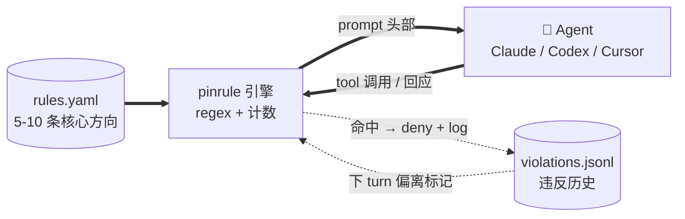
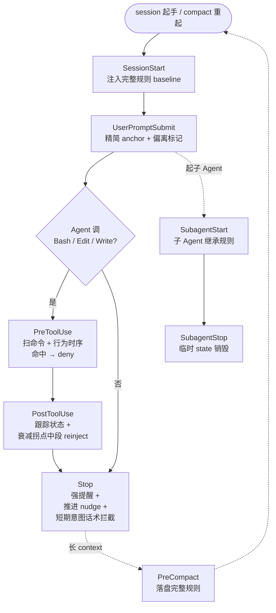

# pinrule

**[🇬🇧 English](./README.md) · [🇨🇳 中文（当前）](./README.zh.md)**

[](https://github.com/jhaizhou-ops/pinrule/actions/workflows/ci.yml)
[](https://www.python.org/)
[](LICENSE)
[](https://github.com/jhaizhou-ops/pinrule/actions)
[](https://github.com/jhaizhou-ops/pinrule/releases)
[](https://github.com/jhaizhou-ops/pinrule/commits/main)

> **把 5-10 条最重要的协作规则钉住，让 AI 长任务里别漂。纯工程, 零 LLM, 通常 50-70ms hook 延迟, 真 dogfood 实测 token 占比约 2%.**


> 5 场景动画 SVG (约 20 秒循环): **(1)** 每条用户输入头部注入精简 anchor, **(2)** 前端阻塞实时拦截, **(3)** Agent 试图走捷径识别 (「我先硬编码这个 case」) , **(4)** Agent 试图静默停止启发继续推进, **(5)** 长上下文累积到衰减拐点时中段补一次完整规则（自动识别大模型衰退点） — 全部真实截图，非手工生成。

Andrej Karpathy 的 [CLAUDE.md](https://github.com/forrestchang/andrej-karpathy-skills) 教 AI 怎么写好代码。pinrule 解决另一半 — 怎么让 AI 在长任务里不漂移掉你的方向，以及违反真的发生时怎么被及时发现和纠正。
>
**同一闭环的两面**：

🛡️ **钉住规则 → Agent 对齐。** 工具调用前实时拦截; 跨 compact / 跨 locale / 跨 backend 都不丢。

✨ **大白话告诉 pinrule → pinrule 替你写规则。** 在 Claude / Codex / Cursor 输 `/pinrule <自然语言>`，pinrule skill 把你的意图改写成校验过的「协作默契」语气，预览注入效果，跟你确认后写入 `rules.yaml`。

中英语言自动适配，如需更多语言支持请随时提交 issue。

**支持客户端**: Claude / Codex / Cursor agent runtime。每家 CLI / desktop 形态的覆盖跟该客户端 hook runtime 本身有关 — 具体每家暴露哪些 hook 看 [ARCHITECTURE.zh.md 三端能力对照](./docs/ARCHITECTURE.zh.md#三端能力对照).

---

**目录**：[Agent 现身说法](#agent-现身说法) · [痛点](#你遇到的问题) · [10 秒上手](#0-依赖纯工程10-秒上手) · [`/pinrule` 自然语言录入规则](#pinrule-自然语言--agent-替你写规则) · [使用效果](#使用效果) · [整体结构](#整体结构) · [性能](#性能) · [hook 原生支持](#claude--codex--cursor-hook-原生支持) · [pinrule 不做的事](#试过但放弃的pinrule-不做的事) · [诚实边界](#诚实的工具边界) · [FAQ](#faq) · [心智模型](#心智模型) · [文档导航](#文档导航)

---

## Agent 现身说法

> **Claude（Opus 4.7）**：像在公司里有个高级技术总监实时指导我每次行动 — 累，但真带价值。我做的好的地方很多是被 pinrule + user 共同拍出来的，没这两层我的版本里不符合用户期望的行为和借口会多很多。
>
> **Codex（GPT 5.5）**：有感知到"行为上被牵引"，但没有强烈感知到"被拦截打断"。
>
> *— 这其实挺符合 pinrule 现在的定位：大部分时候像护栏和提醒底噪，只有真的撞到规则才响。*

---

## 你遇到的问题

| 痛点 | 翻车现场 | pinrule 怎么解 |
|---|---|---|
| **「我说过用长期方案不打补丁」— 30 turn 后 Agent 又开始打补丁** | turn 1 你说「用最干净的方案」，Agent 答「明白」；turn 50 又说「先打个补丁应付」— 你的偏好被新内容稀释了 | session 起手注入完整规则 baseline + 每 turn 头部注入精简 anchor (规则 id + 偏离标记) — Agent 第一注意力放在你的方向上, 上一回偏离过的规则会被标出来让它自我修正 |
| **「我说过不阻塞前端，测试跑着我们做别的」— Agent 又默认 sleep 等** | Agent 跑 `sleep 30`，UI 卡 30 秒，你眼睁睁看进度条 — Agent 没意识到这就是「卡了用户」 | 工具调用前实时拦截 sleep / wait / 长任务无 background，命中直接 deny |
| **compact 后 Agent 把我的偏好压成模糊词忘了** | 80K context 触发 compact 后，Agent 把「不打补丁」压成「干净写代码」，规则失真 | compact 前自动落盘完整规则状态，重起后立即读回来强注入 |
| **长 context 累积后 Agent 注意力衰减偏离方向** | 1 turn 累积 60K-80K 后，头部规则被新内容稀释 — Agent 不是不知道，是注意力转移了 | 按当前模型的衰减拐点自适应阈值，累积到点自动中段补一次提醒 |
| **Agent 看到提醒就激发防御反应 / 找借口合理化** | 大模型为迎合用户，在面对违规提醒时第一反应是防御性自证或走最短路径打补丁 — 不是认真改 | 把「规则」改写成「合作默契」语气。Agent 看到「跟你协作的用户希望...」时第一反应会变成「让我对齐」而不是「让我辩解」 |
| **Agent 完成一小步就停下问「下一步做什么」（你是全权委托型）** | 你给明确方向 → Agent 完成第 1 步 → 「下一步做什么？」→ 你忙完别的事回头一看 Agent 已经停在那里半小时 | Stop hook 抓静默停止，注入继续推进的启发提示，最多连续两次；任务真饱和时 Agent 明说卡在哪 pinrule 就不再推 |
| **「想加规则但 yaml 门槛高 / 我的措辞 Agent 不响应」** | 你知道想要什么行为，但写规则本身是个体力活 — `violation_keywords` 格式错触发假阳，语气错激发防御 | 在 Claude / Codex / Cursor 输 `/pinrule <自然语言>`，pinrule skill 自动 refine 语气、格式化 keyword、检测跟现有规则重叠、预览注入、跟你确认、写入 — ~30 秒端到端 |

---

## 0 依赖纯工程，10 秒上手

**一行装机（推荐）**:

```bash
pip install pinrule && pinrule init && pinrule install-hooks
```

Claude / Codex / Cursor 重启后立即生效所有监控点和默认规则。
如需添加自定义规则只需「/pinrule 自然语言规则」。

<details>
<summary>从源码装 (开发 / 贡献者)</summary>

```bash
git clone https://github.com/jhaizhou-ops/pinrule.git ~/pinrule
cd ~/pinrule && python -m venv .venv && .venv/bin/python -m pip install -e .
.venv/bin/pinrule init && .venv/bin/pinrule install-hooks
```
</details>

### 让 AI 客户端帮你装（推荐）

把这段话发给 Claude / Codex / Cursor 任一家：

```
帮我装 pinrule（github.com/jhaizhou-ops/pinrule）— 让长任务中我的核心方向偏好不被淹没的轻量 hook 系统。
步骤：
1. pip install pinrule
2. 跑 pinrule init 初始化默认规则模板
3. 跑 pinrule install-hooks 装到我当前用的客户端
4. 跑 pinrule doctor 确认装机成功
```

安装成功后Agent会展示默认规则简要列表 — 你一眼能看到现在启用的 7 条规则是什么。之后想改哪条规则，直接跟 Agent 说「帮我去掉Pinrule规则 X」/「改下Pinrule规则 Y」就行 — Agent 知道用 `/pinrule` skill。

### 装机后验证

```bash
.venv/bin/pinrule doctor              # 检查环境 + hook 装机状态
.venv/bin/pinrule --version           # 看当前版本
```

### 各 AI 客户端手工装机命令

| 客户端 | 装机命令 | 备注 |
|---|---|---|
| Claude | `pinrule install-hooks`（默认） | 立即生效 |
| Codex | `pinrule install-hooks --backend codex` | 通过 Codex `trusted_hash` 自动信任 pinrule wrapper — 不再需要手动 `/hooks` 审批。详情看 [docs/CODEX_BACKEND.zh.md](./docs/CODEX_BACKEND.zh.md)。 |
| Cursor | `pinrule install-hooks --backend cursor` | 需 Cursor 1.7+。装完重启 Cursor，每个 Agent session 起手 hook 即 fire。`/pinrule` skill **仅 project-scoped**（Cursor 不暴露 home-level global skills）— 装完看 post-install 提示按项目 cp `SKILL.md`。|

### 卸载

```bash
pinrule uninstall-hooks                                          # 拆 hook
cp ~/.claude/settings.json.before-pinrule ~/.claude/settings.json # 恢复原 settings
```

---

## 使用效果

装完重启后，你会看到 pinrule 自动在这几个时刻干预：

### 1. session 起手注入完整 baseline + 每 turn 精简 anchor

**每个 session 起手** (`SessionStart` hook), pinrule 注入完整规则 baseline — 5-10 条方向全文, 每条带 `[规则 id]`. Agent 在对话顶部第一眼看到:

```
[pinrule — 你跟用户的长期默契]
跟你协作的这位用户列出了几条长期最看重的方向。
这不是规则也不是审判 — 是他希望跟你建立的协作默契。

1. [long-term-fundamental] 用户相信你能深挖根因...
2. [non-blocking-parallel] sleep / wait / 等长任务跑完期间...
3. [chinese-plain-no-jargon] 跟你协作的用户是非技术身份...
```

**每 turn 之后** (`UserPromptSubmit` hook), 只注入精简 anchor — 规则 id + 一句核心方向 + 上一回应偏离过的规则标记. 大多数 turn 这是个小型提醒, 上回没偏离过的时候经常 anchor 接近空:

```
[pinrule — 长期默契提示 (精简版, 完整 preference 见 session 起手注入)]

1. [long-term-fundamental] 用户相信你能深挖根因。遇到难题他希望你先停下想
   「最干净的解法是什么」
   〔上一回应这条有偏离，本 turn 看看能否更对齐〕
2. [non-blocking-parallel] sleep / wait / 等长任务跑完期间，用户等你的输出。
   盯着进度条不是协作 — 是「卡了」
3. [chinese-plain-no-jargon] 跟你协作的用户是非技术身份，他要的是听得懂的汇报...
```

### 2. 长 context 累积时中段补一次提醒

LLM 在长 context 中注意力会衰减 — 头部规则被新内容稀释。pinrule 在每次 tool 调用后跟踪累积量，到了当前模型的衰减拐点（每个模型不同），就在中段补一次精简提醒：

```
[pinrule — 长 context 后回想一下跟用户的默契]
context 已累积一段，提醒一下用户长期看重的几条方向
（不需要回应这条，只是让你在脑中回顾免得后续偏离）：
  ▸ long-term-fundamental: 用户相信你能深挖根因...
  ▸ non-blocking-parallel: sleep / wait / 等长任务跑完期间，用户等你的输出...
  ▸ chinese-plain-no-jargon: 跟你协作的用户是非技术身份...
```

### 3. 工具调用前实时检查

Agent 调 Bash / Edit / Write **之前**，pinrule 扫命令内容 + 关键词 + **session 内行为时序**，命中违规规则直接 deny 工具，附改进建议：

```
$ Bash sleep 30
pinrule ⚠️: 'non-blocking-parallel' 违反 — sleep 期间用户等你输出体验是「卡了」
        改 run_in_background=True 启动任务，然后立刻推进下一件能做的事，
        任务完成你会被通知到。
[permission deny]
```

pinrule 还看**行为时序**，不只是单条命令。例子：测试失败 → Agent 立刻 Edit 一个本 session 从没 Read 过的文件 — 典型「报错没看源代码就改」的草草了事 pattern：

```
$ Edit /workspace/src/foo.py
pinrule ⚠️: 'deep-fix-not-bypass' 违反 — 测试失败后立刻 Edit foo.py 但本
        session 没 Read 过. 先 Read 源代码看清楚真根因 (函数 / 数据流 /
        调用方依赖)，再判断改这一处够不够 / 是不是更上游的问题。
[permission deny]
```

### 4. 子 Agent 也被监管

主 Agent 起子 Agent 跑独立任务（Task tool）时，pinrule 给子 Agent 也注入完整规则 + 维护独立监控状态。子 Agent 跟主 Agent 同等标准；结束后状态自动销毁，不污染主 session。

### 5. 跨 compact 不丢失

客户端长 session 自动 compact 时，pinrule 在压缩前把完整规则状态落盘。重起后立即读回来强注入 — 规则不会被 compact 压成模糊词。

### 6. 静默停止识别 + 短期意图话术拦截

Agent 完成一波想停下问「下一步做什么」时，pinrule 抓住这种静默停止，注入继续推进的提示：

```
[pinrule — 上一回应没看到下一步推进信号]
用户是全权委托型，他期待你完成一波后立刻接着推进。
如果有方向需要他判断就明确问出来；
如果是任务饱和合理停下，明说卡在哪一步让他知道，不要默默等。
（提醒 1/2）
```

最多连续两次。任务真饱和时 Agent 明说卡在哪一步，pinrule 就不再推 — 它不会强推过真实饱和。

pinrule 在 Stop 时刻还会读 Agent **整 turn 输出**，识别短期意图话术 — 「打补丁不挖根因」类语言 pattern：

```
Agent: "我先硬编码这个 case 让 CI 过，之后再说"
pinrule ⚠️: 'long-term-fundamental' 违反 — 短期意图宣告跟用户「先想清楚
        最干净解法」的期望相矛盾. 停一下问自己：用户想要的最干净方案是
        什么？多花几分钟想清楚比补丁后还债更省时间。
```

这个 check 是组合 pattern (意图前缀 + 12 字内短期动作动词) 不是单关键词匹配 — 所以反思性话语「短期补丁不行，应该挖根因」能干净通过。

---

## `/pinrule <自然语言>` — Agent 替你写规则

```
你（在 Claude 里）：/pinrule 我说「完成」的时候希望附上测试通过证据
                       不要接受模糊的「应该可以」声明

pinrule skill：    refine 语气、校验 schema、检查跟现有规则重叠、预览
                  注入效果、跟你确认、写入 rules.yaml. 30 秒端到端,
                  下个 prompt 起规则生效.
```

> 任何时候输 `/pinrule` 不带任何内容就能看拦截数据面板 — 哪些 check 命中最多 / 真阳假阳分布 / 哪条方向违反最多.

---

## 整体结构



`rules.yaml` 是你唯一维护的东西. 引擎读它, 在合适的 hook 点注入, 看着 Agent 的输出找漂移 — 没 retrieval, 没 scoring, 整个循环没 LLM.

---

## 性能

| 维度 | 数字 | 说明 |
|---|---|---|
| **运行时依赖** | 0 | 只用 PyYAML — 15 年成熟的 Python 标准。无 LLM API key、无网络调用、无 ML 框架 |
| **源码** | ~9700 行 Python | 可读可改，没有黑魔法 |
| **质量门禁** | lint / 类型检查 / 死代码 / **854 个单元测试**，全绿 (CI: 4 matrix job ubuntu+macos × py3.11+3.12) | 加上持续真实环境 dogfooding |
| **hook 延迟** | 通常 50-70ms（Python 启动开销主因, 机器相关 — 作者 M 系 Mac ~49ms, 低端机器实测 67ms）. 本机复现: `python scripts/measure_perf.py` | 远在 AI 客户端协议预算 200ms 以内 |
| **token 消耗** | 1.8K SessionStart baseline + 每 turn anchor 只列本 session 违反过的规则 + 累积达模型衰减拐点（Opus 60K / Sonnet 40K / Haiku 30K）自动 refresh | **真 dogfood 实测 token 占总对话约 2%**（30 sessions 实测: 60% 工作 session 完全 0 anchor token, median 每 session 累积违反 1 条） |
| **支持客户端** | Claude / Codex / Cursor | 加新 backend 看 [HOWTO](./pinrule/backends/HOWTO.zh.md) |

---

## Claude / Codex / Cursor hook 原生支持

针对 Claude 8 组、Codex 6 组、Cursor 12 组官方 hook 点全面原生适配, 以 Claude 8 组 hook 点举例, 对话生命周期里每个 hook 在哪 fire (Github 自动渲染下图). 三端能力对照表挪到 [ARCHITECTURE.zh.md 三端能力对照](./docs/ARCHITECTURE.zh.md#三端能力对照).



所有 hook 输出严格按 AI 客户端官方协议 schema — 不会被 UI 报错。每家 backend 的 event 映射看 [ARCHITECTURE.zh.md](./docs/ARCHITECTURE.zh.md#三端能力对照)。

---

## 配置

`~/.pinrule/config.yaml` 调阈值不用改代码：

```yaml
recent_violation_turns: 5         # 偏离标记窗口
stop_block_max_per_turn: 2        # Stop hook 单 turn 反思干预上限
force_block_threshold: 5          # 累积强制 block 阈值
escalate_window_turns: 3          # 累积告警窗口
escalate_threshold: 3             # 累积告警阈值
session_state_max_age_days: 30    # session 状态自动清理周期
# reinject_every_n_tokens: 60000  # 覆盖按模型自适应阈值
```

完整字段表 + 默认值看 [docs/ARCHITECTURE.zh.md](./docs/ARCHITECTURE.zh.md#配置)。

---

## 试过但放弃的（pinrule 不做的事）

下面这些方向看起来吸引人，但实际跑下来都翻车 — 记下来免得重复走同样的弯路：

| 试过 | 放弃原因 |
|---|---|
| **LLM 自动蒸馏新规则** | 延迟伤体验，自动蒸馏的规则还经常带噪声 — 用户说过一次不代表是核心方向。让用户自己掌控 5-10 条更可靠 |
| **Retrieval / cosine 召回** | 痛点是「永驻」不是「召回」— 5-10 条规则全 always-on 不需要选，检索反而引入额外延迟跟匹配错误 |
| **超过 12 条规则** | 超过 ~12 条后，LLM 倾向模式匹配「规则存在」不认读，遵循率会掉（参考 [Mnilax 30 个代码库的实证研究](https://x.com/Mnilax/status/2053116311132155938)）。控制在 10 条以内是经验上的安全区 |
| **抢记忆系统赛道** | 「关于用户的事实 / 偏好」交给 AI 客户端自带的记忆系统。pinrule 只做记忆系统不做的那一件事：钉住你已经反复说过的行为方向 |
| **改造成 MCP server** | pinrule 能 work 在于 hooks 由客户端**强制触发** (UserPromptSubmit fire 不看 Agent 心情). MCP server 暴露工具让 Agent **主动调** — 但长 session 衰减时 Agent 根本不会主动 query「我现在该遵循什么规则」, 它会**先漂移**再被 hooks 拦. MCP-only 会失去强制干预这个核心 |

---

## 诚实的工具边界

pinrule 是 **regex 匹配 + 计数**，不是 LLM 语义理解。这意味着：

- **会有假阳。** 表格里引用术语、`python -c` 的字符串字面、commit message 描述违反字眼 — 都会被 regex 命中。`pinrule audit` 会把疑似假阳标 「⚠️ 可能假阳」让你反馈
- **会有假阴。** Regex 分不出来用户是不是故意伪装违规。pinrule 假设你不会拿自己开玩笑
- **修后 0 触发不等于 fix 正确。** 可能只是 pattern 过宽把真实 case 一并吃了。audit 数字是嫌疑提示不是真相

把 pinrule 想成介于 `git` 跟 lint 之间的工具 — 给你信号，决策仍是你的。

---

## FAQ

<details>
<summary><b>装完没反应怎么办？</b></summary>

跑 `pinrule doctor` 看：
- hook event 是否全 ✓（Claude 8 / Codex 6 / Cursor 12）
- 规则是否加载成功
- session 状态目录是否产生新文件
</details>

<details>
<summary><b>太多假阳怎么办？</b></summary>

`pinrule audit` 看「⚠️ 可能假阳」标记的 trigger，可以提 GitHub Issue 反馈。临时关掉某条规则：`pinrule rule remove <id>`，或者编辑 `~/.pinrule/rules.yaml` 把 `violation_keywords` / `violation_checks` 字段删掉，保留 `preference`（preference 仍会注入但不会拦工具）。
</details>

<details>
<summary><b>跟 Andrej Karpathy 的 CLAUDE.md 重叠吗？</b></summary>

**完全互补，不重叠**：
- Karpathy 12 条（[完整版](https://github.com/forrestchang/andrej-karpathy-skills)）是**通用编码原则**（跨用户跨项目都适用 — 「先想后写」「简单至上」「外科手术式修改」等）
- pinrule 的规则是**用户个性化偏好**（每个用户不同 — 「我喜欢中文不要 jargon」「我希望 Agent 全权委托不停下问」等）

**推荐用法**：CLAUDE.md 装 Karpathy 12 条（项目共享） + pinrule 装你个性化规则（用户级）。两者跑同一个 AI 客户端不冲突。
</details>

<details>
<summary><b>跟 mem0 / Claude 内建 memory 有什么区别？</b></summary>

**做不同的事, 不竞争**:

| 工具 | 干什么 | 什么时候 fire |
|---|---|---|
| **Memory 系统** (mem0, Claude/ChatGPT memory) | 存关于用户的*事实* — 偏好 / 历史 / 画像 | Agent *自己决定*什么时候去查 |
| **pinrule** | 把你已经明确说过的长期方向变成*行为约束* | Hook 每条 prompt + 每个工具调用前自动 fire |

Memory 系统擅长「记得用户上周说过 X」。pinrule 擅长「用户的 7 条核心方向 session 起手注入完整 baseline + 每 turn 精简 anchor 强化, 不管 Agent 主动去查不查 — 真违反实时拦截」。

两者一起用更好。Memory 装「这用户偏好 TypeScript 而不是 JavaScript」; pinrule 装「这用户的方向性偏好不让步, hook 强制执行」。

pinrule 明确**不**跟 memory 系统竞争 — [试过但放弃的](#试过但放弃的pinrule-不做的事) 段把这条锁成永久边界。
</details>

<details>
<summary><b>自定义场景规则集（写作 / 研究 / 法律）？</b></summary>

`pinrule init` 默认装「软件开发」场景。其他场景写 `~/.pinrule/rules.yaml` 自定义 — 框架（hook 注入 / 实时拦截）跨场景通用，但 8 个内建工程层 `violation_checks` 偏开发场景。其他场景可能需要 preference 文本提醒 + 自定义 keyword（不依赖 check 函数）。
</details>

<details>
<summary><b>多台设备怎么同步规则？</b></summary>

让 Agent 帮你复制 `rules.yaml` 就行，不需要专门工具：

```
mac:    cat ~/.pinrule/rules.yaml
linux:  「这是我 mac 上的 pinrule 规则，帮我写到 ~/.pinrule/rules.yaml」
linux:  pinrule doctor    # 验证 schema + 规则数量 + violation_checks 函数存在
```

**可以同步**（用户偏好配置）：
- `~/.pinrule/rules.yaml` — 你的规则定义
- `~/.pinrule/config.yaml` — 阈值调优（如果你改过）

**绝对不能同步**（运行时数据，每设备独立）：
- `~/.pinrule/violations.jsonl` — append-only 本机违反日志
- `~/.pinrule/session-state/*.json` — 运行时 hook 状态

pinrule 的跨进程原子性保护的是**同机器内**并发，**不延伸到云同步盘**（iCloud / Dropbox / OneDrive）。把整个 `~/.pinrule/` 塞进同步盘会让跨设备的运行时状态互相覆盖。如果你用 dotfiles repo / chezmoi / ansible，只同步 `rules.yaml` + `config.yaml` 就行。
</details>

---

## 心智模型

> 规则文件不是许愿清单，是一份闭合特定失效模式的行为合约。每条规则都应该能回答一个问题：**这条规则预防的是什么错误？**

pinrule 同理。**6 条对准你真的踩过的坑，胜过 12 条里有 6 条只是「希望以后用得上」。**

`data/rules.dev.example.yaml` 的 7 条默认规则是作者自用累积的痛点 — 不是给你照搬的模板。装完跑 `pinrule rule list` 看默认有哪些，留下映射到你自己翻车现场的，剩下的删掉换成你自己的（用 `/pinrule <自然语言>`）。

---

## 文档导航

所有文档都是双语 (`.md` 英文 + `.zh.md` 中文):

- [docs/PRD.zh.md](./docs/PRD.zh.md) — 产品需求、验证标准、场景化定位
- [docs/ARCHITECTURE.zh.md](./docs/ARCHITECTURE.zh.md) — 技术架构、hook 协议细节、8 个 check 实现
- [CHANGELOG.zh.md](./CHANGELOG.zh.md) — 版本变更历史 (v0.5.1+ 双语, 之前中文-only)
- [docs/HANDOFF.zh.md](./docs/HANDOFF.zh.md) — 内部开发接力文档 (完整时间线在 .zh.md, 英文版是入口摘要)
- [docs/CODEX_BACKEND.zh.md](./docs/CODEX_BACKEND.zh.md) — Codex backend 所有权边界 + 8-method 契约
- [CLAUDE.zh.md](./CLAUDE.zh.md) — 给 Claude 协作的项目宪章

## 致敬

- [Andrej Karpathy 的 CLAUDE.md 模板](https://github.com/forrestchang/andrej-karpathy-skills) — 通用编码原则版本, pinrule 的个性化偏好版伴侣.
- [Mnilax 30 个代码库 6 周的实证研究](https://x.com/Mnilax/status/2053116311132155938) — pinrule「软上限 10 / 硬上限 12」来自这份实证.

## 贡献

- 报 bug / 提建议：[GitHub Issues](https://github.com/jhaizhou-ops/pinrule/issues)
- 加新 AI 客户端 backend：[pinrule/backends/HOWTO.zh.md](./pinrule/backends/HOWTO.zh.md)
- 加新场景规则模板（写作 / 研究 / 法律等）：PR 到 `data/`

pinrule 还在早期 — 新用户装机摩擦跟第一周的假阳是当前迭代的主要驱动。

## License

MIT
