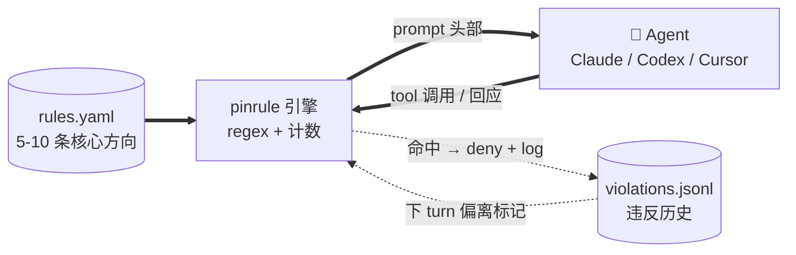

# pinrule

**[🇬🇧 English](./README.md) · [🇨🇳 中文（当前）](./README.zh.md)**

[](https://github.com/jhaizhou-ops/pinrule/actions/workflows/ci.yml)
[](https://www.python.org/)
[](LICENSE)
[](https://github.com/jhaizhou-ops/pinrule/actions)
[](https://github.com/jhaizhou-ops/pinrule/releases)
[](https://github.com/jhaizhou-ops/pinrule/commits/main)

> **把 5-10 条最重要的协作规则钉住，让 AI 长任务里别漂。**
> 纯工程 · 零 LLM · ~50-70ms hook · 真 dogfood 实测 token 占比约 2%.


Andrej Karpathy 的 [CLAUDE.md](https://github.com/forrestchang/andrej-karpathy-skills) 教 AI 怎么*写好代码*。pinrule 让 AI 在长任务里*跟你的个性化偏好对齐* — 哪些事永远别做、哪些事一定要做、哪些地方要回推 — 不用你每 30 turn 重复一遍。

---

## 10 秒上手

```bash
pip install pinrule && pinrule init && pinrule install-hooks
```

重启 Claude / Codex / Cursor. 默认规则生效。加一条个性化规则:

```
/pinrule 我说「完成」的时候希望附上测试通过证据.
```

skill refine 语气、校验 schema、跟你确认后写入 — ~30 秒.

---

## pinrule 做什么

- **注入** 你的 5-10 条方向 — session 起手注入 baseline, 每 turn 头部带精简 anchor, 长 context 衰减时自动 reinject 完整.
- **实时拦漂移** — Bash `sleep`、Edit 没 Read 先改、「我先硬编码」类短期意图话术, 都在执行前拦下.
- **跨 compact 不丢** — compact 前完整规则状态落盘, 重起后自动重新加载注入.

每个 hook 在哪 fire 看 [ARCHITECTURE.zh.md](./docs/ARCHITECTURE.zh.md#三端能力对照).

---

## 整体结构



`rules.yaml` 是你唯一维护的东西. 引擎读它, 在合适的 hook 点注入, 看着 Agent 输出找漂移 — 没 retrieval, 没 scoring, 整个循环没 LLM.

---

## 跟 AI memory 类工具不一样

| 工具 | 存什么 | 什么时候 fire |
|---|---|---|
| **Memory** (mem0, Claude memory) | 关于你的*事实* (偏好 / 历史 / 画像) | Agent 自己决定什么时候去查 |
| **pinrule** | 你已经说过的长期*行为方向* | Hook 每条 prompt + 每个工具调用前自动 fire |

两个一起用. Memory 装「我偏好 TypeScript」, pinrule 装「方向性偏好不让步, hook 强制」.

---

## 性能

| | |
|---|---|
| **运行时依赖** | 0 (只用 PyYAML) |
| **hook 延迟** | ~50-70ms (机器相关; 本机复现 `scripts/measure_perf.py`) |
| **token 占比** | 真 dogfood 实测约 2% (60% 工作 session 完全 0 anchor token) |
| **测试** | 854 单元, CI 4 矩阵全绿 (ubuntu+macos × py3.11+3.12) |
| **支持客户端** | Claude / Codex / Cursor — [加新 backend](./pinrule/backends/HOWTO.zh.md) |

---

## 各客户端装机 + 卸载

| 客户端 | 命令 |
|---|---|
| Claude (默认) | `pinrule install-hooks` |
| Codex | `pinrule install-hooks --backend codex` |
| Cursor 1.7+ | `pinrule install-hooks --backend cursor` |

```bash
pinrule uninstall-hooks                                          # 拆 hook
cp ~/.claude/settings.json.before-pinrule ~/.claude/settings.json # 恢复
```

Codex 细节: [docs/CODEX_BACKEND.zh.md](./docs/CODEX_BACKEND.zh.md). Cursor `/pinrule` skill 是 project-scoped (Cursor 不暴露 home-level global skills) — 装完看 post-install 提示.

---

## 试过但放弃的

下面这些方向看起来吸引人, 但实际跑下来都翻车 — 记下来免得重复走弯路:

| 试过 | 放弃原因 |
|---|---|
| **LLM 自动蒸馏新规则** | 延迟伤体验, 自动蒸馏的规则带噪声 — 用户说过一次不代表是长期方向. |
| **Retrieval / cosine 召回** | 痛点是「永驻」不是「召回」— 5-10 条规则 always-on 不需要选. |
| **超过 12 条规则** | 超 ~12 后 LLM 模式匹配「规则存在」不认读 (参考 [Mnilax 30 个代码库的实证研究](https://x.com/Mnilax/status/2053116311132155938)). |
| **改造成 MCP server** | hook 是**强制触发**, MCP 是 Agent **主动调** — 长 session 衰减时 Agent 不会主动 query「我现在该遵循什么」, 先漂移再被 hook 拦. |

---

## 诚实的工具边界

pinrule 是 **regex + 计数**, 不是 LLM 语义理解.

- **会有假阳.** 表格里引用术语、`python -c` 字符串字面、commit message 描述违反字眼 — 都可能命中. `pinrule audit` 把疑似假阳标「⚠️ 可能假阳」.
- **会有假阴.** Regex 分不出来用户是不是故意伪装. pinrule 假设你不会拿自己开玩笑.
- **修后 0 触发不等于 fix 对.** 可能是 pattern 过宽把真 case 一并吃了.

把 pinrule 想成介于 `git` 跟 lint 之间的工具 — 给信号不给判决.

---

## FAQ

<details>
<summary><b>装完没反应？</b></summary>
跑 <code>pinrule doctor</code> — 检查 hook event、规则加载、session 状态.
</details>

<details>
<summary><b>太多假阳？</b></summary>
<code>pinrule audit</code> 看「⚠️ 可能假阳」标记, 提 GitHub Issue 反馈. 临时关一条规则: <code>pinrule rule remove &lt;id&gt;</code>, 或编辑 <code>~/.pinrule/rules.yaml</code> 把 <code>violation_keywords</code> / <code>violation_checks</code> 字段删掉.
</details>

<details>
<summary><b>非开发场景规则集 (写作 / 研究 / 法律)？</b></summary>
框架跨场景, 但 8 个内建 <code>violation_checks</code> 偏开发. 其他场景自己写 <code>rules.yaml</code> — preference 文本 + 自定义 keyword (不依赖 engine check).
</details>

<details>
<summary><b>多台设备怎么同步规则？</b></summary>
让 Agent 帮你复制 <code>~/.pinrule/rules.yaml</code>. <b>可以同步</b>: <code>rules.yaml</code> + <code>config.yaml</code>. <b>绝对不能</b>: <code>violations.jsonl</code>、<code>session-state/</code> (运行时数据, 每设备独立 — 云同步盘会让跨设备 state 互相覆盖).
</details>

<details>
<summary><b>跟 Karpathy 的 CLAUDE.md 重叠吗？</b></summary>
互补. Karpathy 12 条是<b>通用编码原则</b> (跨用户). pinrule 是<b>个性化偏好</b> (每用户不同). 两个一起用.
</details>

---

## Agent 装完 pinrule 后说的话

> **Claude (Opus 4.7)**: 像在公司里有个高级技术总监实时指导每次行动 — 累, 但真带价值. 没 pinrule 我的版本里不符合用户期望的行为会多很多.
>
> **Codex (GPT 5.5)**: 有感知到「行为上被牵引」, 没有强烈感知到「被拦截打断」.
>
> *— 符合 pinrule 现在的定位: 大部分时候像护栏 + 提醒底噪, 真撞规则才响.*

---

## 心智模型

> 规则文件不是许愿清单, 是闭合特定失效模式的行为合约. 每条规则都该回答: **这条规则预防的是什么错误?**

`data/rules.dev.example.zh.yaml` 的 7 条默认规则是作者自用累积的痛点, 不是给你照搬的模板. 装完跑 `pinrule rule list` 看默认, 留下映射到你自己翻车现场的, 剩下的删掉换成你自己的 (用 `/pinrule <自然语言>`).

---

## 文档导航

- [PRD.zh.md](./docs/PRD.zh.md) — 产品需求 + 场景化定位
- [ARCHITECTURE.zh.md](./docs/ARCHITECTURE.zh.md) — hook 协议 / 8 个 check 实现 / sandbox 模型
- [HOOK_CONFIGURATION_GUIDE.zh.md](./docs/HOOK_CONFIGURATION_GUIDE.zh.md) — 每 hook 在哪 fire / 可调阈值
- [CHANGELOG.zh.md](./CHANGELOG.zh.md) — 版本变更历史 (按 minor 聚合)
- [CODEX_BACKEND.zh.md](./docs/CODEX_BACKEND.zh.md) — Codex backend 所有权边界
- [CLAUDE.zh.md](./CLAUDE.zh.md) — 给 Claude 协作的项目宪章

所有文档双语 (`.md` 英文 + `.zh.md` 中文).

## 致敬

- [Andrej Karpathy 的 CLAUDE.md 模板](https://github.com/forrestchang/andrej-karpathy-skills) — 通用编码原则版本, pinrule 的个性化偏好版伴侣.
- [Mnilax 30 个代码库 6 周的实证研究](https://x.com/Mnilax/status/2053116311132155938) — pinrule「软上限 10 / 硬上限 12」来自这份实证.

## 贡献

- bug / 建议: [GitHub Issues](https://github.com/jhaizhou-ops/pinrule/issues)
- 加新 AI 客户端 backend: [HOWTO](./pinrule/backends/HOWTO.zh.md)
- 加新场景规则模板: PR 到 `data/`

## License

MIT
