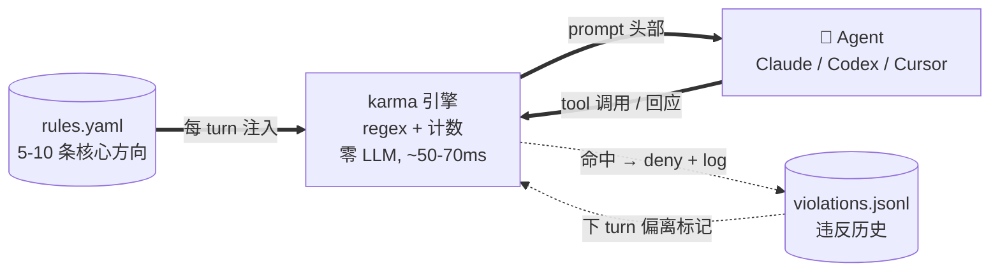

# karma

**[🇬🇧 English](./README.md) · [🇨🇳 中文（当前）](./README.zh.md)**

[](https://github.com/jhaizhou-ops/karma/actions/workflows/ci.yml)
[](https://www.python.org/)
[](LICENSE)
[](https://github.com/jhaizhou-ops/karma/actions)
[](https://github.com/jhaizhou-ops/karma/releases)
[](https://github.com/jhaizhou-ops/karma/commits/main)

> **让 AI 在长任务里不忘掉你的规则。纯工程, 零 LLM, 通常 50-70ms hook 延迟, 真 dogfood 实测 token 占比约 2%.**


> 5 场景动画 SVG (约 80 秒循环): **(1)** 每条用户输入头部注入简版规则, **(2)**前端阻塞实时拦截, **(3)** Agent试图走捷径识别 (「我先硬编码这个 case」) , **(4)** Agent 试图静默停止启发继续推进, **(5)** 长上下文累积到衰减拐点时中段补一次完整规则（自动识别大模型衰退点） — 全部真实截图，非手工生成。

Andrej Karpathy 的 [CLAUDE.md](https://github.com/forrestchang/andrej-karpathy-skills) 教 AI 怎么写好代码。karma 解决另一半 — 怎么让 AI 在长任务里不漂移掉你的方向，以及违反真的发生时怎么被及时发现和纠正。
>
**同一闭环的两面**：

🛡️ **钉住规则 → Agent 对齐。** 5-10 条核心方向注入每个 prompt 头部；工具调用前实时拦截；跨 compact / 跨 locale / 跨 backend 都不丢。

✨ **大白话告诉 karma → karma 替你写规则。** 在 Claude Code / Codex / Cursor 输 `/karma <自然语言>`，karma skill 把你的意图改写成校验过的「协作默契」语气，预览注入效果，跟你确认后写入 `rules.yaml`。`karma init` 自动装到 Claude / Codex (Cursor 协议级限 project-scoped 看安装提示)。

中英语言自动适配，如需更多语言支持请随时提交issue。。

---

**目录**：[Agent 现身说法](#agent-现身说法) · [痛点](#你遇到的问题) · [10 秒上手](#0-依赖纯工程10-秒上手) · [`/karma` 自然语言录入规则](#karma-自然语言--agent-替你写规则) · [使用效果](#使用效果) · [原理](#为什么有效) · [性能](#性能) · [8 个 hook 全覆盖](#8-个-hook-位置全覆盖) · [karma 不做的事](#试过但放弃的karma-不做的事) · [诚实边界](#诚实的工具边界) · [FAQ](#faq) · [心智模型](#心智模型) · [文档导航](#文档导航)

---

## Agent 现身说法

> **Claude（Opus 4.7）**：像在公司里有个高级技术总监实时指导我每次行动 — 累，但真带价值。我做的好的地方很多是被 karma + user 共同拍出来的，没这两层我的版本里不符合用户期望的行为和借口会多很多。
>
> **Codex（GPT 5.5）**：有感知到"行为上被牵引"，但没有强烈感知到"被拦截打断"。
>
> *— 这其实挺符合 karma 现在的定位：大部分时候像护栏和提醒底噪，只有真的撞到规则才响。*

---

## 你遇到的问题

| 痛点 | 翻车现场 | karma 怎么解 |
|---|---|---|
| **「我说过用长期方案不打补丁」— 30 turn 后 Agent 又开始打补丁** | turn 1 你说「用最干净的方案」，Agent 答「明白」；turn 50 又说「先打个补丁应付」— 你的偏好被新内容稀释了 | 把 5-10 条核心方向钉在每条 prompt 头部，Agent 每次都先看到 |
| **「我说过不阻塞前端，测试跑着我们做别的」— Agent 又默认 sleep 等** | Agent 跑 `sleep 30`，UI 卡 30 秒，你眼睁睁看进度条 — Agent 没意识到这就是「卡了用户」 | 工具调用前实时拦截 sleep / wait / 长任务无 background，命中直接 deny |
| **compact 后 Agent 把我的偏好压成模糊词忘了** | 80K context 触发 compact 后，Agent 把「不打补丁」压成「干净写代码」，规则失真 | compact 前自动落盘完整规则状态，重起后立即读回来强注入 |
| **长 context 累积后 Agent 注意力衰减偏离方向** | 1 turn 累积 60K-80K 后，头部规则被新内容稀释 — Agent 不是不知道，是注意力转移了 | 按当前模型的衰减拐点自适应阈值，累积到点自动中段补一次提醒 |
| **Agent 看到提醒就激发防御反应 / 找借口合理化** | 大模型为迎合用户，在面对违规提醒时第一反应是防御性自证或走最短路径打补丁 — 不是认真改 | 把「规则」改写成「合作默契」语气。Agent 看到「跟你协作的用户希望...」时第一反应会变成「让我对齐」而不是「让我辩解」 |
| **Agent 完成一小步就停下问「下一步做什么」（你是全权委托型）** | 你给明确方向 → Agent 完成第 1 步 → 「下一步做什么？」→ 你忙完别的事回头一看 Agent 已经停在那里半小时 | Stop hook 抓静默停止，注入继续推进的启发提示，最多连续两次；任务真饱和时 Agent 明说卡在哪 karma 就不再推 |
| **「想加规则但 yaml 门槛高 / 我的措辞 Agent 不响应」** | 你知道想要什么行为，但写规则本身是个体力活 — `violation_keywords` 格式错触发假阳，语气错激发防御 | 在 Claude Code / Codex / Cursor 输 `/karma <自然语言>`，karma skill 自动 refine 语气、格式化 keyword、检测跟现有规则重叠、预览注入、跟你确认、写入 — ~30 秒端到端 |

---

## 0 依赖纯工程，10 秒上手

```bash
git clone https://github.com/jhaizhou-ops/karma.git ~/karma
cd ~/karma && python -m venv .venv && .venv/bin/python -m pip install -e .
.venv/bin/karma init && .venv/bin/karma install-hooks
```

Claude Code / Codex CLI / Cursor 重启后立即生效所有监控点和默认规则。
如需添加自定义规则只需“/karma 自然语言规则”。

### 让 AI 客户端帮你装（推荐）

把这段话发给 Claude Code / Codex / Cursor 任一家（desktop 或 CLI 均支持）：

```
帮我装 karma（github.com/jhaizhou-ops/karma）— 让长任务中我的核心方向偏好不被淹没的轻量 hook 系统。
步骤：
1. git clone 到 ~/karma
2. 创建 .venv 装 pip install -e .
3. 跑 karma init 初始化默认规则模板
4. 跑 karma install-hooks 装到我当前用的客户端
5. 跑 karma doctor 确认装机成功
```

安装成功后Agent会展示默认规则简要列表 — 你一眼能看到现在启用的 5-7 条规则是什么。之后想改哪条规则，直接跟 Agent 说「帮我去掉Karma规则 X」/「改下Karma规则 Y」就行 — Agent 知道用 `/karma` skill。

### 装机后验证

```bash
.venv/bin/karma doctor              # 检查环境 + hook 装机状态
.venv/bin/karma --version           # 看当前版本
```

### 各 AI 客户端手工装机命令

| 客户端 | 装机命令 | 备注 |
|---|---|---|
| Claude Code | `karma install-hooks`（默认） | 立即生效 |
| Codex CLI | `karma install-hooks --backend codex` | 通过 Codex `trusted_hash` 自动信任 karma wrapper — 不再需要手动 `/hooks` 审批。详情看 [docs/CODEX_BACKEND.zh.md](./docs/CODEX_BACKEND.zh.md)。 |
| Cursor | `karma install-hooks --backend cursor` | 需 Cursor 1.7+。装完重启 Cursor，每个 IDE Agent session 起手 hook 即 fire。`/karma` skill **仅 project-scoped**（Cursor 不暴露 home-level global skills）— 装完看 post-install 提示按项目 cp `SKILL.md`。|

### 卸载

```bash
.venv/bin/karma uninstall-hooks                                # 拆 hook
cp ~/.claude/settings.json.before-karma ~/.claude/settings.json # 恢复原 settings
```

---

## 使用效果

装完重启后，你会看到 karma 自动在这几个时刻干预：

### 1. 每条 prompt 头部注入规则全文 + 偏离标记

每条 user prompt 提交时，karma 把你的 5-10 条核心方向 + 上一回应偏离过的规则提醒**加到对话头部**，Agent 第一眼看见：

```
[karma — 你跟用户的长期默契]
跟你协作的是一位这位用户，他列出了几条长期最看重的方向。
这不是规则也不是审判 — 是他希望跟你建立的协作默契。

1. 用户相信你能深挖根因。遇到难题他希望你先停下想「最干净的解法是什么」
   〔上一回应这条有偏离，本 turn 看看能否更对齐〕
2. sleep / wait / 等长任务跑完期间，用户等你的输出...
3. 跟你协作的用户是非技术身份，他要的是听得懂的汇报...
...
```

### 2. 长 context 累积时中段补一次提醒

LLM 在长 context 中注意力会衰减 — 头部规则被新内容稀释。karma 在每次 tool 调用后跟踪累积量，到了当前模型的衰减拐点（每个模型不同），就在中段补一次精简提醒：

```
[karma — 长 context 后回想一下跟用户的默契]
context 已累积一段，提醒一下用户长期看重的几条方向
（不需要回应这条，只是让你在脑中回顾免得后续偏离）：
  ▸ long-term-fundamental: 用户相信你能深挖根因...
  ▸ non-blocking-parallel: sleep / wait / 等长任务跑完期间，用户等你的输出...
  ▸ chinese-plain-no-jargon: 跟你协作的用户是非技术身份...
```

### 3. 工具调用前实时检查

Agent 调 Bash / Edit / Write **之前**，karma 扫命令内容 + 关键词 + **session 内行为时序**，命中违规规则直接 deny 工具，附改进建议：

```
$ Bash sleep 30
karma ⚠️: 'non-blocking-parallel' 违反 — sleep 期间用户等你输出体验是「卡了」
        改 run_in_background=True 启动任务，然后立刻推进下一件能做的事，
        任务完成你会被通知到。
[permission deny]
```

karma 还看**行为时序**，不只是单条命令。例子：测试失败 → Agent 立刻 Edit 一个本 session 从没 Read 过的文件 — 典型「报错没看源代码就改」的草草了事 pattern：

```
$ Edit /workspace/src/foo.py
karma ⚠️: 'deep-fix-not-bypass' 违反 — 测试失败后立刻 Edit foo.py 但本
        session 没 Read 过. 先 Read 源代码看清楚真根因 (函数 / 数据流 /
        调用方依赖)，再判断改这一处够不够 / 是不是更上游的问题。
[permission deny]
```

### 4. 子 Agent 也被监管

主 Agent 起子 Agent 跑独立任务（Task tool）时，karma 给子 Agent 也注入完整规则 + 维护独立监控状态。子 Agent 跟主 Agent 同等标准；结束后状态自动销毁，不污染主 session。

### 5. 跨 compact 不丢失

客户端长 session 自动 compact 时，karma 在压缩前把完整规则状态落盘。重起后立即读回来强注入 — 规则不会被 compact 压成模糊词。

### 6. 静默停止识别 + 短期意图话术拦截

Agent 完成一波想停下问「下一步做什么」时，karma 抓住这种静默停止，注入继续推进的提示：

```
[karma — 上一回应没看到下一步推进信号]
用户是全权委托型，他期待你完成一波后立刻接着推进。
如果有方向需要他判断就明确问出来；
如果是任务饱和合理停下，明说卡在哪一步让他知道，不要默默等。
（提醒 1/2）
```

最多连续两次。任务真饱和时 Agent 明说卡在哪一步，karma 就不再推 — 它不会强推过真实饱和。

karma 在 Stop 时刻还会读 Agent **整 turn 输出**，识别短期意图话术 — 「打补丁不挖根因」类语言 pattern：

```
Agent: "我先硬编码这个 case 让 CI 过，之后再说"
karma ⚠️: 'long-term-fundamental' 违反 — 短期意图宣告跟用户「先想清楚
        最干净解法」的期望相矛盾. 停一下问自己：用户想要的最干净方案是
        什么？多花几分钟想清楚比补丁后还债更省时间。
```

这个 check 是组合 pattern (意图前缀 + 12 字内短期动作动词) 不是单关键词匹配 — 所以反思性话语「短期补丁不行，应该挖根因」能干净通过。

---

## `/karma <自然语言>` — Agent 替你写规则

这是 karma 的另一面 — **伙伴**面，不是**监督**面。

```
你（在 Claude Code 里）：/karma 我说「完成」的时候希望附上测试通过证据
                       不要接受模糊的「应该可以」声明

Agent（karma skill 自动走 7 步）：
  ① 识别意图 — 检测 anchor-vs-scope 歧义
  ② 检查现有规则 — 语义重叠决策（修改 vs 新加）
  ③ 内联起草 yaml — 协作默契语气、locale 感知
  ④ karma rule preview — schema + REGISTRY 校验
  ⑤ 跟你确认 — 措辞 / keyword / engine-check 调整
  ⑥ karma rule add — 原子写入 rules.yaml
  ⑦ 反馈 — 当前数量、生效时机、冗余建议

→ 30 秒端到端，下个 UserPromptSubmit 起规则生效
```

> **任何时候输 `/karma` 不带任何内容**就能看拦截数据面板 — 哪些 engine check 命中最多 / 真阳假阳分布 / keyword-only 兜底占比。Agent 读完数据告诉你Agent哪条方向违反最多，你可以决定增加或砍掉哪条规则。

### skill 替你做的事
karma skill指令会帮助你生成最合适的规则描述方式：
| 写规则的难点 | skill 怎么处理 |
|---|---|
| **语气 — 「你必须 X」对 LLM 反向激发防御** | 重写成 karma「协作默契」语气。长期实测 LLM 对此回应是「我来对齐」不是「我来争辩」 |
| **格式 — 裸 keyword 触发假阳** | 转换成「意图前缀 + 动作」格式（如 `"我先打个补丁"` 不是 `"补丁"`），讨论 vs 行动可区分 |
| **重叠 — 不小心加重复规则浪费 slot** | 4 行 overlap 决策表（完全重复 / superset / keyword 交集 / 无重叠）；建议 modify 现有不是膨胀到 11 条 |
| **作用域歧义 — 「在 X 场景下做 Y」往往是 anchor 不是 scope** | 主动问出来「确认下：所有协作时还是只 X 时？」而不是默默猜 |
| **locale — 给中文用户写英文 preference** | 检测用户聊天语言，中文用户写中文 preference，英文用户写英文。`violation_checks` 函数名保持英文（稳定标识符） |
| **修改 vs 新加 — 没单独 `rule replace` 命令** | 知道 `remove + add` recipe 原子组合；保留 `id` 让违反历史连续 |

### 四家 backend — 三家自动装，Cursor 限 project-scoped

| Backend | 路径（自动装机） | 客户端内触发方式 |
|---|---|---|
| Claude Code | `~/.claude/skills/karma/SKILL.md` | `/karma <自然语言>` |
| Codex CLI | `~/.agents/skills/karma/SKILL.md`（注：`~/.agents/` 跟 Anthropic 共享） | `/skills` menu / `$karma <描述>` inline / auto-trigger |
| Cursor | **不自动装（协议限制 project-scoped only）** — Cursor 没有 home-level global skills 目录。需在每个目标项目手工 cp `skills/karma/SKILL.md` 到 `.cursor/skills/karma/`。 | `/karma`（项目内）或直接走 `karma rule add` CLI |

仓库内一份 Markdown source of truth 在 [`skills/karma/SKILL.md`](./skills/karma/SKILL.md)；`karma install-skill` 直接写 raw Markdown 到各 backend。

### karma 升级后更新 skill

```bash
karma install-skill --force          # 强制覆盖所有 backend 的 skill 为当前版本
karma install-skill --backend codex  # 只更新一家 backend
```

不带 `--force` 时，新版本会写到 `.new` 兄弟文件让你先 `diff` 本地改动跟 upstream 对比再决定。`karma doctor` 报每个 backend 的 skill 装机状态。

---

## 为什么有效

系统架构一图看清:



`rules.yaml` 是karma唯一核心的规则列表. karma将其自动注入到每个 prompt 头部。
Karma 自动工程化0联网扫Agent工具调用 + Agent 回应的文字找违反规则的迹象并提示/警告/拦截，还将把检测到的漂移反馈到下 turn 的偏离标记. 没 retrieval, 没 scoring, 整个循环没 LLM.

karma 不是 lint、不是评分、不是搜索召回。它解决的是 4 个实际但常被忽视的 LLM 协作问题：

### 1. 长 context 注意力衰减是存在的

当代大模型衰减拐点比早期模型晚，但仍然存在。规则放在对话顶部，几十轮后会被新内容稀释 — Agent 不是不知道，是注意力转移了。karma 在每个模型衰减开始的精确 context 长度补一次提醒。

### 2. 每次对话都「重新失忆」

每个 AI 客户端的工作机制是「把所有上下文重新发给模型」— 模型不持续记住任何东西。你说过的偏好每次都得重新送进去。karma 自动做这件事，不用你重复说。

### 3. 「合作默契」语气比「规则系统」激活的反应不一样

LLM 看到「请始终遵守 X」「⚠️ 上次违反」类警示词时，第一反应是防御性自证或找借口绕过 — 因为这激活的是「我做错事被骂」的心理。

karma 把规则改写成「跟你协作的这位用户希望...」语气 — Agent 读到的不是判决而是默契约定，第一反应从「让我辩解」变成「让我对齐」。这是长期自用中最能影响提醒被真正内化的单一改动。

### 4. hook 覆盖没有死角

karma 装机后在 8 个 hook 位置都有监管（详见下一章）— 不是「对话开始注入一次」就完。tool 调用前后 / 子 Agent 启停 / compact 前后 / 静默停止 — 每一个可能漂移的时刻都有针对性的注入或检查。

---

## 性能

| 维度 | 数字 | 说明 |
|---|---|---|
| **运行时依赖** | 0 | 只用 PyYAML — 15 年成熟的 Python 标准。无 LLM API key、无网络调用、无 ML 框架 |
| **源码** | ~8600 行 Python | 可读可改，没有黑魔法 |
| **质量门禁** | lint / 类型检查 / 死代码 / 775 个单元测试，全绿 (CI: 4 matrix job ubuntu+macos × py3.11+3.12) | 加上持续真实环境 dogfooding |
| **hook 延迟** | 通常 50-70ms（Python 启动开销主因, 机器相关 — 作者 M 系 Mac ~49ms, 低端机器实测 67ms） | 远在 AI 客户端协议预算 200ms 以内 |
| **token 累积消耗** | 1.8K SessionStart baseline（一次性, 但每 turn re-send）+ 每 turn anchor **只列本 session 违反过的规则**（v0.13.0+; 没违反 = 0 anchor）+ 累积达模型衰减拐点（Opus 60K / Sonnet 40K / Haiku 30K）自动 refresh | **真 dogfood 实测 token 占总对话约 2%**（30 sessions 实测: 60% 工作 session 完全 0 anchor token, median 每 session 累积违反 1 条）。极端: 维护者撞 sticky 多的 session 能到 ~10%（天花板, 普通用户 1-3%）. v0.13.0 让 anchor 累积成本比 v0.12.x「每 turn 全列」省 45-80% |
| **API input 账单占比** | SessionStart 前缀 + 每轮**新增** anchor/catalog；历史前缀走 **prompt cache read（Anthropic 约 input 价 10%）** | **典型工程 session 约 1–3%**；违反多或 Cursor 每轮 id catalog 约 **2–4%**；v0.12 每轮全列 id 约 **10–15%**（机制估算，非逐张 invoice 对账）。长 session 占**上下文窗口**约 4–6%，与账单不是同一指标 |
| **磁盘占用** | < 10MB | 配置 + 历史违规日志 + session 状态 |
| **模型适配** | 按模型衰减拐点的自适应阈值 | 主流模型用各自实测的衰减点 |
| **支持客户端** | Claude Code / Codex CLI / Cursor | 加新 backend 看 [HOWTO](./karma/backends/HOWTO.zh.md) |
| **用户语言** | 中文 + 英文，可扩展 | 7 个检测信号全外部化到 `data/signals/<name>/{zh,en}.txt`（平面字眼）或 `.yaml`（cartesian 模板 + 词集）。加新语言 = ~7 个小文件，零 Python 代码 |

---

## 8 个 hook 位置全覆盖

对话生命周期里每个 hook 在哪 fire (Github 自动渲染下图):


| Hook 位置 | 生效功能与场景 | 解决的痛点 |
|---|---|---|
| **每次用户提问时**（UserPromptSubmit）| 头部注入完整规则 + 偏离标记 | Agent 长 session 后忘记你说过的偏好 |
| **每次工具调用前**（PreToolUse）| 关键词 + 工程层双层检测，命中规则直接拒绝 | Agent 想跑 sleep / 想 commit --no-verify / 想绕过规则 |
| **每次工具调用后**（PostToolUse）| 跟踪文件 read / edit / bash 状态 + 累积达阈值自动中段刷新规则 | 长 context 累积后注意力衰减，Agent 偏离原方向 |
| **Agent 停止生成时**（Stop）| 终端 stderr ⚠️ 提醒 + 桌面通知 + 静默停止启发性反思干预 + 短期意图话术识别 | Agent 完成一波就停下问下一步，用户被反复打扰 |
| **每次 session 起手**（SessionStart）| session 起手注入规则 baseline，compact 重起时读 snapshot 强注入 | 跨 session / 跨 compact 规则不丢失 |
| **AI 客户端压缩历史前**（PreCompact）| 落盘完整规则状态 snapshot 给 SessionStart 重读 | compact 后 Agent 把规则压成模糊词忘了 |
| **子 Agent 启动时**（SubagentStart）| 子 Agent 自动继承完整规则集 + 写独立监控状态 | 子 Agent 跑独立任务时漏出监管覆盖 |
| **子 Agent 结束时**（SubagentStop）| 子 Agent 临时状态自动销毁，不污染主 session | 多次起子 Agent 后状态累积，主 session 数据混乱 |

所有 hook 输出严格按 AI 客户端官方协议 schema — 不会被 UI 报错。

---

## 配置

`~/.claude/karma/config.yaml` 调阈值不用改代码：

```yaml
recent_violation_turns: 5         # 偏离标记窗口
stop_block_max_per_turn: 2        # Stop hook 单 turn 反思干预上限
force_block_threshold: 5          # 累积强制 block 阈值
escalate_window_turns: 3          # 累积告警窗口
escalate_threshold: 3             # 累积告警阈值
session_state_max_age_days: 30    # session 状态自动清理周期
# reinject_every_n_tokens: 60000  # 覆盖按模型自适应阈值
```

完整字段表 + 默认值看 [docs/ARCHITECTURE.zh.md](./docs/ARCHITECTURE.zh.md#配置)。

---

## 试过但放弃的（karma 不做的事）

下面这些方向看起来吸引人，但实际跑下来都翻车 — 记下来免得重复走同样的弯路：

| 试过 | 放弃原因 |
|---|---|
| **LLM 自动蒸馏新规则** | 延迟伤体验，自动蒸馏的规则还经常带噪声 — 用户说过一次不代表是核心方向。让用户自己掌控 5-10 条更可靠 |
| **Retrieval / cosine 召回** | 痛点是「永驻」不是「召回」— 5-10 条规则全 always-on 不需要选，检索反而引入额外延迟跟匹配错误 |
| **超过 12 条规则** | 超过 ~12 条后，LLM 倾向模式匹配「规则存在」不认读，遵循率会掉（参考 [Mnilax 30 个代码库的实证研究](https://x.com/Mnilax/status/2053116311132155938)）。控制在 10 条以内是经验上的安全区 |
| **抢记忆系统赛道** | 「关于用户的事实 / 偏好」交给 AI 客户端自带的记忆系统。karma 只做记忆系统不做的那一件事：钉住你已经反复说过的行为方向 |
| **引入 LLM 依赖** | 延迟和成本都是问题。纯工程让 hook 保持在 50-70ms 区间，装机也可复现 |
| **奖惩 / RL 评分系统** | 行为提示不是 reward function — 给规则打分会让模型优化分数而不优化行为 |
| **阻止 compact** | compact 是客户端的保护机制，karma 不该跟它对抗 — 用 PreCompact 落盘 + SessionStart 重读跨过去 |
| **「请始终遵守 / 立即按 fix / 不要再犯」类警示词** | 激活的是防御反应或找绕过路径。「合作默契」改写让 Agent 第一反应变成「让我对齐」— 这是真正影响遵循率的单一最关键改动 |
| **`suggested_fix` 写死数字阈值** | 看到「34% < 40%」LLM 会去优化数字（凑中文字数）而不优化可读性。改成目标描述（「读完不用查词」）避免被对着数字打补丁 |

---

## 诚实的工具边界

karma 是 **regex 匹配 + 计数**，不是 LLM 语义理解。这意味着：

- **会有假阳。** 表格里引用术语、`python -c` 的字符串字面、commit message 描述违反字眼 — 都会被 regex 命中。`karma audit` 会把疑似假阳标 「⚠️ 可能假阳」让你反馈
- **会有假阴。** Regex 分不出来用户是不是故意伪装违规。karma 假设你不会拿自己开玩笑
- **修后 0 触发不等于 fix 正确。** 可能只是 pattern 过宽把真实 case 一并吃了。audit 数字是嫌疑提示不是真相

把 karma 想成介于 `git` 跟 lint 之间的工具 — 给你信号，决策仍是你的。

---

## FAQ

<details>
<summary><b>装完没反应怎么办？</b></summary>

跑 `karma doctor` 看：
- hook event 是否全 ✓（Claude Code 8 / Codex 4 / Cursor 5）
- 规则是否加载成功
- session 状态目录是否产生新文件
</details>

<details>
<summary><b>太多假阳怎么办？</b></summary>

`karma audit` 看「⚠️ 可能假阳」标记的 trigger，可以提 GitHub Issue 反馈。临时关掉某条规则：`karma rule remove <id>`，或者编辑 `~/.claude/karma/rules.yaml` 把 `violation_keywords` / `violation_checks` 字段删掉，保留 `preference`（preference 仍会注入但不会拦工具）。
</details>

<details>
<summary><b>跟 Andrej Karpathy 的 CLAUDE.md 重叠吗？</b></summary>

**完全互补，不重叠**：
- Karpathy 12 条（[完整版](https://github.com/forrestchang/andrej-karpathy-skills)）是**通用编码原则**（跨用户跨项目都适用 — 「先想后写」「简单至上」「外科手术式修改」等）
- karma 的规则是**用户个性化偏好**（每个用户不同 — 「我喜欢中文不要 jargon」「我希望 Agent 全权委托不停下问」等）

**推荐用法**：CLAUDE.md 装 Karpathy 12 条（项目共享） + karma 装你个性化规则（用户级）。两者跑同一个 AI 客户端不冲突。
</details>

<details>
<summary><b>自定义场景规则集（写作 / 研究 / 法律）？</b></summary>

`karma init` 默认装「软件开发」场景。其他场景写 `~/.claude/karma/rules.yaml` 自定义 — 框架（hook 注入 / 实时拦截）跨场景通用，但 8 个内建工程层 `violation_checks` 偏开发场景。其他场景可能需要 preference 文本提醒 + 自定义 keyword（不依赖 check 函数）。
</details>

<details>
<summary><b>多台设备怎么同步规则？</b></summary>

让 Agent 帮你复制 `rules.yaml` 就行，不需要专门工具：

```
mac:    cat ~/.claude/karma/rules.yaml
linux:  「这是我 mac 上的 karma 规则，帮我写到 ~/.claude/karma/rules.yaml」
linux:  karma doctor    # 验证 schema + 规则数量 + violation_checks 函数存在
```

**可以同步**（用户偏好配置）：
- `~/.claude/karma/rules.yaml` — 你的规则定义
- `~/.claude/karma/config.yaml` — 阈值调优（如果你改过）

**绝对不能同步**（运行时数据，每设备独立）：
- `~/.claude/karma/violations.jsonl` — append-only 本机违反日志
- `~/.claude/karma/session-state/*.json` — 运行时 hook 状态

karma 的跨进程原子性保护的是**同机器内**并发，**不延伸到云同步盘**（iCloud / Dropbox / OneDrive）。把整个 `~/.claude/karma/` 塞进同步盘会让跨设备的运行时状态互相覆盖。如果你用 dotfiles repo / chezmoi / ansible，只同步 `rules.yaml` + `config.yaml` 就行。
</details>

---

## 心智模型

> 规则文件不是许愿清单，是一份闭合特定失效模式的行为合约。每条规则都应该能回答一个问题：**这条规则预防的是什么错误？**

karma 同理。**6 条对准你真的踩过的坑，胜过 12 条里有 6 条只是「希望以后用得上」。**

`data/rules.dev.example.yaml` 的 7 条默认规则是作者自用累积的痛点 — 不是给你照搬的模板。装完跑 `karma rule list` 看默认有哪些，留下映射到你自己翻车现场的，剩下的删掉换成你自己的（用 `/karma <自然语言>`）。

---

## 文档导航

所有文档都是双语 (`.md` 英文 + `.zh.md` 中文):

- [docs/PRD.zh.md](./docs/PRD.zh.md) — 产品需求、验证标准、场景化定位
- [docs/ARCHITECTURE.zh.md](./docs/ARCHITECTURE.zh.md) — 技术架构、hook 协议细节、8 个 check 实现
- [CHANGELOG.zh.md](./CHANGELOG.zh.md) — 版本变更历史 (v0.5.1+ 双语, 之前中文-only)
- [docs/HANDOFF.zh.md](./docs/HANDOFF.zh.md) — 内部开发接力文档 (完整时间线在 .zh.md, 英文版是入口摘要)
- [docs/CODEX_BACKEND.zh.md](./docs/CODEX_BACKEND.zh.md) — Codex backend 所有权边界 + 8-method 契约
- [CLAUDE.zh.md](./CLAUDE.zh.md) — 给 Claude Code 协作的项目宪章

## 致敬

- [Andrej Karpathy 的 CLAUDE.md 编码原则模板](https://github.com/forrestchang/andrej-karpathy-skills) — 通用编码原则。跟 karma 互补不冲突：Karpathy 教模型*怎么*写好代码，karma 让你的*偏好*在长任务里不漂移
- [Mnilax 在 30 个代码库 6 周的实证研究](https://x.com/Mnilax/status/2053116311132155938) — karma「软上限 10 / 硬上限 12」直接借鉴这份实证结论

## 贡献

- 报 bug / 提建议：[GitHub Issues](https://github.com/jhaizhou-ops/karma/issues)
- 加新 AI 客户端 backend：[karma/backends/HOWTO.zh.md](./karma/backends/HOWTO.zh.md)
- 加新场景规则模板（写作 / 研究 / 法律等）：PR 到 `data/`

karma 还在早期 — 新用户装机摩擦跟第一周的假阳是当前迭代的主要驱动。

## License

MIT
